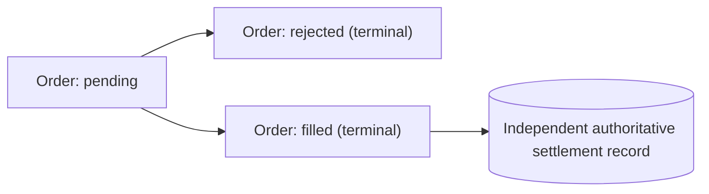

# ADR-0001：Paper order 生命周期与 M2 验收语义

| 项目 | 内容 |
|---|---|
| 状态 | Accepted |
| 日期 | 2026-07-24 |
| 适用范围 | Dota 2 direct-only live shadow/paper 决策链 |
| 关联计划 | `docs/betting-decision-production-readiness-development-plan-2026-07-24.md` |

## 背景

开发计划原先同时要求 paper order 由 first successor `fill/reject`，再完成 settlement，并把合法路径写成 `pending -> filled/rejected -> settled`。这与当前领域模型冲突：正式 settlement 只接受 order 和 map attempt 均为 `filled` 的订单；`rejected` order 不可结算。

如果不固定该语义，团队可能把一条无法结算的 rejected order 误报为 M2 完成，也无法为测试、通知和 report 定义一致的验收结果。

## 决策

1. `paper order` 与 `shadow order` 指同一个领域对象。
2. 每个 `(raybet_match_id, map_number)` 最多有一个 shadow map attempt。Order 与 attempt 在同一事务中创建为 `pending`，并在同一事务中同步进入相同终态；rejected attempt 也会消耗该 map 的唯一尝试资格。
3. Order 创建后的初始状态是 `pending`。Order identity 和 evidence lineage 不可变；lifecycle 只允许一次 `pending -> terminal` 原子迁移。
4. `pending` 只能解析为以下两个互斥终端结果之一：
   - `pending -> rejected`：订单生命周期终止，不允许创建 settlement；
   - `pending -> filled`：订单成交，之后才有资格创建独立的权威 settlement 记录。
5. `settled` 不是 `shadow_orders.status` 的第三个终态，而是 filled order 关联有效权威 settlement record 的派生事实。
6. First successor 固定为 signal event time 之后、按 `(observed_at, observation_key)` 升序选择的第一条 `source='direct'`、`timing_status='on_time'`、`processing_status='processed'` transport observation。不得因其缺 outcome、身份冲突、市场关闭或价格不利而跳过它。`observed_at == expires_at` 位于 15 秒窗口内；第一条 successor 晚于 expiry 时 reject 为 `fill_timeout`；没有 processed successor 时保持 pending，worker wall clock 本身不触发 timeout。
7. M2 仅在同一自然产生的 eligible order 同时满足以下条件时完成：
   - immutable decision identity、order identity 和 vision/draft/direct evidence lineage 完整；
   - first processed direct successor 在含端点的规定窗口内将 order 解析为 `filled`；
   - `filled` notification outbox payload、事务边界和 formal lineage 可验证；
   - ADR-0003 定义的 RayBet/OpenDota dual-source 权威 settlement 完成；
   - `settled` notification outbox payload、事务边界和 formal lineage 可验证；
   - order 和 settlement 进入 production report，且不进入 browser production projection。
8. `pending -> rejected` 可以作为订单拒绝路径的运行证据，但不完成 M1/M2，也不生成 `filled` 或 `settled` outbox。创建该 order 的 eligible decision 可按 ADR-0002 参与 M1 验收，order rejection 本身不能替代策略链证据。
9. `pending -> filled` 但 settlement 缺失、无效或仍待人工复核时，不完成 M2。

## 后果

- M2 的日历完成时间可能增加；第一条合法 order 被 reject 后必须等待后续尚未 attempt 的 map/canary。
- 拒绝路径与成交结算路径必须分别报告，不能用一个 `fill/reject` 汇总状态代替。
- 测试必须证明 rejected order 不会产生 settlement，settlement verifier 对非 filled order fail closed。
- 当前 settlement 实现无需因本决策放宽；文档和验收材料应与其 filled-only 前置条件保持一致。
- 该决策不改变策略 gate、stake sizing、真实资金边界或 M1 qualifying rejection 的定义。
- 实际 SMTP 投递不属于 M1/M2 完成条件；outbox 与 delivery health 的边界由 ADR-0013 定义。
- Settlement 的事实源、pending/manual-review 行为和 M2-F 由 ADR-0003 定义。

## 未采用的解释

- **Rejected order 也完成 M2**：无法满足正式 settlement 前置条件，拒绝采用。
- **只要创建 paper order 就完成 M2**：不能证明 successor、settlement、notification 和 report 链路，拒绝采用。
- **把 rejected order 伪装成 settled**：混淆执行结果与赛果标签，拒绝采用。

## 验证要求

- 正向：order 执行 `pending -> filled`，随后关联 authoritative settlement record，并生成 filled/settled outbox 与 report。
- 负向：`pending -> rejected` 后 settlement 行为被拒绝，report 不把它计作 settled order 或 M2。
- 中间态：`pending -> filled` 但 settlement 尚未完成时，M2 保持未完成。
