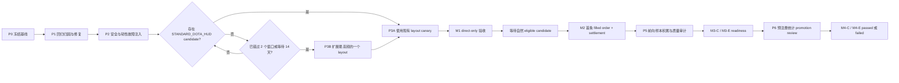

# Dota 2 Paper 投注决策生产就绪开发计划

## 1. 文档状态与适用边界

| 项目 | 内容 |
|---|---|
| 日期 | 2026-07-24 |
| 状态 | Accepted，批准按本文 gate 执行 |
| 目标系统 | Dota 2 direct-only live shadow/paper 决策链 |
| 当前策略 | `comeback-shadow-v4-controlled-entry` |
| 市场主源 | RayBet internal `/v2/match`、`/v2/odds`，`source='direct'` |
| 局内事实权威 | HLS Vision，`LiveObservation schema_version = 4` |
| 正式结算权威 | RayBet direct final + OpenDota exact reconciliation |
| 当前数据库 | `D:\dota2-predictor-cutovers\20260718-043023\restore\dota2.db` |
| 当前 raw archive | 与上述数据库配对的 `restore\live_betting\raw-v2` |
| 资金边界 | 只生成 shadow/paper order、将其 resolve 为 filled/rejected，并且只结算 filled order；不提交真实投注 |
| 数据边界 | 原地使用现有 SQLite 和 raw archive，不迁移、不复制、不切库 |

本文把项目从“决策代码已实现、服务已运行”推进到以下四个含义不同、逐级解锁的里程碑：

1. **M1：direct-only 决策链已验收**：一场合格直播产生 eligible decision，或经正式 verifier 确认的 qualifying strategy rejection，并完成端到端权威核对；
2. **M2：首次合法 filled-and-settled paper order**：至少一条决策自然通过全部 v4 gate，形成 paper order，由第一个 processed direct successor 成交，并完成 RayBet direct final + OpenDota exact reconciliation、结算和 report；
3. **M3：策略达到分轨评审样本门槛**：分别积累权威标注的 eligible-decision calibration cohort 和 filled-settled economic cohort；每轨达到 72h maturity、identity、500 samples/100 series/3 events/support/concentration 和 LOEO 可计算要求，M3-C 另须通过 outcome coverage；前者用于概率/阈值，后者用于 ROI/执行/stake sizing。
4. **M4：策略统计 promotion 决策**：相关 M3 track ready 后，按预注册 gate 对冻结 cohort 作出可复现的 passed/failed 决策；样本数量本身不能完成 M4。

M1 不等于 M2，M2 不等于策略盈利，M3 ready 也不等于 M4 passed。真实资金执行不属于本文范围。

Paper order 生命周期和 M2 验收语义由 ADR-0001 固定；M1 qualifying rejection 由 ADR-0002 固定；正式结算权威和 M2-F 由 ADR-0003 固定；M3 双 cohort 与 M3/M4 边界由 ADR-0004/0005 固定；M3 coverage/diversity 和 M4 event sensitivity 由 ADR-0008 固定；M4-C scoring/ECE 由 ADR-0006/0007 固定，M4-E 由 ADR-0008/0009 固定；版本化策略合同由 ADR-0010 固定；P0 evidence manifest 和 rollback proof 由 ADR-0011 固定；测试例外、layout/SMTP 边界、revocation/governance 分别由 ADR-0012/0013/0014 固定。全部文件位于 `docs/adr/`；仓库通用语言入口为 `CONTEXT.md`，本计划的详细词汇见 `docs/betting-decision-domain-glossary.md`。

## 2. 依据与当前结论

本计划以以下文档为事实基线：

- `docs/raybet-direct-api-primary-collection-design.md`；
- `docs/raybet-direct-api-primary-collection-handoff-2026-07-23.md`；
- `docs/comeback-v4-phase2-handoff-2026-07-22.md`；
- `docs/monitoring-console-operations-manual.md`；
- `live_betting/README.md`。

仓库根目录的 `DESIGN.md` 是旧模块基线，不是本计划的验收来源。

### 2.1 2026-07-24 运行审计快照

审计时 direct-only supervisor 和 Web 已使用同一生产数据库运行，且未启动 companion。最后一次实时检查显示：

- `market_source_policy=direct_primary`；
- direct market collection、Vision capability、paper decision 和 draft publisher 均可报告 healthy；
- browser compare 为 `stopped`，属于不影响 readiness 的可选诊断能力；
- shadow worker 处于 `waiting_for_confirmed_vision`；
- Vision worker 为 idle，active watcher 为 `0`；
- 当前只有一场 upcoming EPL 比赛，direct odds 为 ready，但 strict mapping、Vision 和 model 均为 missing；
- active alerts 为 `0`。

健康的 worker 只证明进程和心跳可用，不证明任一具体比赛具备决策条件。比赛级 readiness 必须分别检查 odds、mapping、Vision、model 和 strategy。

### 2.2 当前生产数据基线

当前配对 `service_report.json` 的 production projection 为：

| 指标 | 当前值 |
|---|---:|
| production decisions | 0 |
| eligible decisions | 0 |
| paper orders | 0 |
| settled paper orders | 0 |
| v4 candidates | 0 |
| HUD confirmed | 0 |
| controlled deficit | 0 |
| Rosh direction passed | 0 |
| v4 eligible | 0 |
| stability status | `descriptive_only` |

SQLite 中存在 147 条旧 `strategy_decisions`，但它们没有可验证的 direct transport lineage，全部不属于当前 direct-only production projection；不能把它们计作当前系统已经产生过的有效投注决策。

### 2.3 当前测试基线

2026-07-24 使用当前工作树、同一 Python 环境和 `-p no:cacheprovider` 复跑交接文档指定的八个文件，结果如下：

| 测试范围 | 结果 | 当前判断 |
|---|---|---|
| 六个 direct-primary 聚焦文件 | 296 passed，12 failed，36 subtests passed | 未达到验收门槛 |
| `test_successor_fill.py` + `test_shadow_monitor_safety.py` | 46 passed，20 failed，22 subtests passed | 未达到验收门槛 |
| 全量测试 | 未执行 | 不得声明全仓通过 |

12 个聚焦失败分布为：

- `tests/test_raybet_stream_scripts.py`：2 个，fixture 缺 strict exact team metadata；
- `tests/test_monitoring_dashboard.py`：10 个，涉及 v4 live evidence、严格 authority、历史决策过滤和 monitoring contract/golden fixture 漂移。

20 个宽回归失败分布为：

- `tests/test_successor_fill.py`：5 个，涉及 formal notification decision lineage 和 legacy stake schema upgrade；
- `tests/test_shadow_monitor_safety.py`：15 个，主要表现为严格 authority 下 pending order fixture 无法插入，以及后续 fill/reject 安全断言无法进入目标路径。

ADR-0003 指定的四个 dual-source settlement critical 文件不在上述八文件历史基线内；其独立 pass/fail 基线当前记为 unknown，必须在 P0 补跑，不能从全量测试未执行推断为通过。ADR-0012 已把八文件与这四文件统一为 12-file production-critical set，P4/M1 前必须全部零失败。

这些失败可能包含测试 fixture 与新 contract 不一致，也可能暴露真实实现回归。在完成与基线 `8f6d4cd` 的独立对比前，不得归类为“无关”，更不得通过删除测试或降低 gate 完成验收。

## 3. 目标与非目标

### 3.1 目标

1. 把交接文档指定的 direct-primary、successor fill 和 shadow safety 测试全部恢复为绿色，并验证 dual-source settlement critical suite。
2. 证明 browser later/current/first-successor 不会影响 production decision、watermark、fill、settlement、report 或 Web projection。
3. 在本机真实 OpenCV/FFmpeg build 下证明 signed HLS secret 不进入日志、SQLite、artifact、health 或 Web response。
4. 证明 60 秒 live-list cache、59/60/61 秒边界、进程重启无 cache 和逐场 429/5xx backoff 与 health/Web 一致。
5. 提供至少一种可实际遇到的、带固定真实证据和 replay negative case 的受支持 broadcast layout。
6. 选择人工批准的 Tier 1 正赛，关闭 extension/companion，完成一次 direct-only canary；若订单成交，先记录 M2-F，再继续到 dual-source settlement。
7. 建立 v4 forward funnel、eligible-decision outcome calibration cohort 与 filled-settled economic cohort 的持续积累、审计、M3 readiness 和 M4 promotion 纪律。

### 3.2 非目标

- 不实现真实投注 endpoint、账户登录、资金托管、自动下单或 bankroll management。
- 不绕过登录、验证码、地区限制、访问控制或其他技术保护措施。
- 不降低 strict event、exact mapping、Vision replay gate、`0.90` 置信度、edge、odds、Rosh 或 data quality 门槛来制造订单。
- 不把 browser、DOM、播放器进度、market name 或 series score 升级为生产局内事实。
- 不在回归闭环阶段修改 comeback v4 的策略语义、阈值或 stake sizing。
- 不为本计划迁移、复制、压缩或切换生产 SQLite。
- 不清理或回滚与本计划无关的既有工作树修改和运行产物。

## 4. 完成定义

### 4.1 M1：direct-only 决策链已验收

以下条件必须同时成立：

1. ADR-0012 列出的 12 个 production-critical 测试文件全部通过，零失败且不允许例外；
2. 全量测试的任何其他失败都满足 ADR-0012：在 clean `8f6d4cd` 独立复现、证明与 production chain 无关，并绑定具名 owner、ticket 和未过期 deadline；
3. production transport key 全部来自 direct；
4. browser 注入不改变 production current、watermark、first successor、fill、settlement、report 和 Web freshness；
5. signed HLS marker 在所有日志和持久层零命中；
6. TTL、backoff、latency metadata 与 health/Web 一致；
7. companion 未配置不产生异常计数或 P0/P1 告警；
8. 一场人工批准且 Vision layout 受支持的真实直播，按 ADR-0010 的版本化 canonical evaluator 和同一 policy hash 完成 `/match -> /odds -> HLS -> Vision v4 -> eligible decision/qualifying strategy rejection -> completed feed/report` 重放；若订单 filled，还必须继续完成 settlement；若订单 rejected，则核对其终态和拒绝证据；
9. Web、supervisor 和 workers 使用同一 database/raw archive pair，数据库 identity 在 canary 前后不变；
10. 没有 SQLite schema migration 或历史 observation 重写。

只有 `docs/adr/0002-m1-qualifying-strategy-rejection.md` 定义的 qualifying strategy rejection 可以完成 M1。它必须由 canonical evaluator 在全部必需输入和 authority 完整后产生，并由正式 verifier 从持久化 lineage 重算确认。`waiting_for_*`、pre-strategy `no_signal`，以及任何 missing、stale、invalid、identity、authority 或 source 类失败只能证明局部 fail closed，不能完成 M1。

### 4.2 M2：首次合法 filled-and-settled paper order

在 M1 基础上，至少一次自然满足以下条件。下列内容是 ADR-0010 可执行策略合同的人类可读摘要，不是独立的规范 predicate；canary 必须重放 decision 绑定的同一 evaluator artifact 和 policy hash，二者不一致时 fail closed：

- strict event 和 exact map/team mapping 已批准；
- direct winner market 完整且 fresh；
- 两个未复用 direct transport snapshot 满足稳定性约束；
- Vision v4 确认 live、时钟、Radiant side、击杀和 canonical 经济 bucket；
- 游戏时间在 20:00–45:00；
- 弱队击杀落后 2–10，underdog canonical economy bucket 仅允许 `1k..9k`；`10k=10000..10999` 因超过 maximum 10,000 而 invalid；
- Vision confidence 不低于 `0.90`；
- 弱队赔率在 2.50–12.00；
- Rosh underdog probability 大于 `0.50`；
- draft landmark 通过 support/calibration live gate；
- aggregate data quality 不低于 `0.20`；
- 至少存在一个独立正向贡献；
- edge 不低于 `0.08`，且 conservative probability 高于 market probability。

订单随后必须：

1. 写入 immutable decision identity、order identity 和 vision/draft/direct evidence lineage；order lifecycle 只允许一次原子终态迁移；
2. 使用 signal event time 之后按 `(observed_at, observation_key)` 排序的第一个 on-time、processed、direct successor；不得跳过会导致 rejection 的首条 successor；
3. 该 successor 的 `observed_at` 不晚于含端点的 15 秒 expiry，并将 order 完成 fill；
4. 生成可验证的 `filled` notification outbox payload、事务边界和 formal lineage；
5. RayBet direct final evidence 与 OpenDota evidence 对同一 strict mapping、`dota_match_id` 和 winner 完成 confirmed reconciliation；
6. filled order 依据该 dual-source authority 完成 settlement，并生成可验证的 `settled` notification outbox payload、事务边界和 formal lineage；
7. order 和 settlement 进入 production report，且不进入任何 browser projection。

`pending -> rejected` 是终态，不能再 settlement，也不能完成 M2；它只能证明订单拒绝路径按设计工作。`pending -> filled` 但尚未完成权威结算，同样不能完成 M2。

`M2-F` 是非正式运行检查点：同一自然 eligible order 已完成 `pending -> filled`，filled outbox payload/transaction/formal lineage、decision/order/evidence lineage 和 production report projection 均可验证。M2-F 不等于 M2，不代表赛果已核验，也不得用于 ROI/Brier 或 settled sample 计数。同一 M2-F order 在 dual-source reconciliation 成功后可继续完成正式 M2。

RayBet 或 OpenDota evidence 缺失/延迟时，reconciliation 保持 pending 并重试，M2 未完成；任一身份、winner 或 authority 冲突进入 sticky `manual_review`，不生成正式 settled sample，也不完成 M2。OpenDota 只参与赛后 outcome confirmation，不能成为市场、决策、watermark 或 fill 的输入或 fallback。实际 SMTP email 投递不阻塞 M1/M2；SMTP 失败只影响 delivery health，但 outbox payload、事务边界或 lineage 失败仍阻塞对应里程碑。

每个 `(raybet_match_id, map_number)` 最多创建一个 shadow map attempt。Order 与 attempt 原子创建为 `pending`，并原子 resolve 为相同的 `filled` 或 `rejected`；rejected attempt 会消耗该 map 的唯一尝试资格。没有 processed direct successor 时，order 保持 pending；worker wall clock 超过 expiry 本身不产生 timeout，只有第一条 processed successor 的 event time 晚于 expiry 才产生 `fill_timeout`。

不得为了完成 M2 临时降低门槛或手工写订单。若合格 canary 只有策略 rejection，或 paper order 被 successor reject，应保留证据并等待后续尚未 attempt 的 map/canary。

### 4.3 M3：策略达到分轨评审样本门槛

M3 必须输出两个互不混算的 readiness track：

| Track | 样本单位 | 必需 outcome/authority | 允许指标与用途 |
|---|---|---|---|
| M3-C：calibration | 每条自然 forward、authority 完整的 eligible strategy decision；不以 fill 为条件 | 赛后 RayBet/OpenDota confirmed outcome label；label 与 settlement 分离 | Brier、log loss、ECE/calibration bins、相对 market improvement、entry threshold 和 Rosh direction 分析 |
| M3-E：economic/execution | 每条真实 filled 且通过 ADR-0003 正式 settlement 的 order | confirmed reconciliation、非 review settlement | slippage、signal-to-fill latency、ROI/PnL、drawdown、stake sizing；fill/reject rate 由独立 selection audit 使用全部 eligible orders 计算 |

Rejected、未成交或最终仍 pending 的 order，只要其 eligible decision 取得双源权威 outcome label，就进入 M3-C；它们不得创建伪 settlement，也不得进入 ROI、PnL 或 M3-E。M2-F 在 outcome label 尚未 confirmed 时不进入任何 scored cohort。Outcome 缺失必须进入 coverage/missingness 报告，不能重建、插补或静默删除。

100 条 provisional 分界与正式 readiness 纪律分别应用于两个 track，计数不得相加：

| 单一 track 的有效 forward 样本 | 允许结论 |
|---:|---|
| `<100` | 仅描述漏斗、coverage、错误和分桶，不调参 |
| `100..499` | 可分析方向，所有结论仍为 provisional |
| `>=500` 但任一适用的 maturity/diversity/coverage 条件未满足 | 仍为 not ready；不得通过选择 cutoff、删 event 或合并 cohort 规避 |
| `>=500`、`>=100` series、`>=3` events、每 event `>=50` 且最大 event 占比 `<=50%` | 达到该 track 的 diversity readiness；M3-C 还必须通过 mature outcome coverage，仍不表示 M4 passed |

Cutoff 为 UTC `T` 时，两个 track 的 readiness samples 都必须来自权威 map completion time `<= T-72h` 的 mature maps；M3-C coverage denominator 是其中全部有效 eligible decisions。M3-C confirmed outcome coverage 必须 overall `>=95%`、每 event `>=90%`，且 filled 与 `non-filled=rejected|pending|no_order` coverage 的绝对差 `<=5` 个百分点；maturity/identity 不可确定、必要 denominator 为零、coverage 不足或分组被静默删除时均不 ready。M3-E 仍只使用 filled + formally settled samples，不用 outcome label 冒充 settlement。

M3-C ready 只解锁 M4-C calibration promotion review；M3-E ready 只解锁 M4-E economic promotion review。完整 cohort identity 不兼容的样本不得 pooling。M3 本身不允许宣告策略通过，也不直接授权阈值或 stake 变更。

### 4.4 M4：策略统计 promotion 决策

M4 是可失败的正式决策，而不是样本计数别名：

| Track | 前置 readiness | 决策用途 |
|---|---|---|
| M4-C | 同一完整 cohort identity 的 M3-C ready | Probability calibration、entry threshold、Rosh direction 等预测/入场语义 |
| M4-E | 同一完整 cohort identity 的 M3-E ready | Execution policy、stake sizing 和经济表现声明 |

每个 track 独立输出 `not_ready`、`review_required`、`failed` 或 `passed`。涉及两个 track 的变更必须两者都 passed；不得把一个 track 的通过扩展解释为另一个 track 也通过。

M4 必须使用在查看目标 cohort 结果前冻结并 content-addressed 的 promotion specification，至少定义 metrics、cluster unit、置信区间、coverage、market baseline、event sensitivity、slippage/drawdown 和通过逻辑。正式结果必须绑定 cohort identity、data cutoff、report hash、spec hash、每项 gate 结果、分析作者、M4 decision owner、独立审批人和时间；分析作者不得成为唯一 approver。

M4 `failed` 是合法终态，不撤销 M1/M2/M3，也不得通过事后换 metric、删 event、合并不兼容 cohort 或修改 cutoff 重新包装为 passed。M4 `passed` 只允许提出新策略版本及其独立 backtest/forward plan，不自动部署，也不能覆盖 `comeback-shadow-v4-controlled-entry` 的历史语义。

M4-C 已接受的核心 scoring hard gates 为：

| Gate | Pass 条件 |
|---|---|
| Absolute Brier | M3-C cohort 的 model Brier `<0.25` |
| Absolute log loss | M3-C cohort 的 model log loss `<ln(2)` |
| Brier vs market | `market_brier - model_brier` 的 paired series-cluster bootstrap 90% CI lower bound `>0` |
| Log loss vs market | `market_log_loss - model_log_loss` 的 paired series-cluster bootstrap 90% CI lower bound `>0` |

Model 与 decision-time de-vigged market baseline 必须在完全相同的 M3-C samples 上成对比较；cluster unit 为 `raybet_match_id` series，当前冻结方法为 deterministic 1,000-iteration percentile bootstrap。任一已计算 hard gate 不满足即 M4-C `failed`。Metric/CI 无法计算、identity 不完整或 artifact/hash 缺失时保持 `review_required`，不能解释为 failed 或 passed。M4-C 以 active ADR-0008 M3-C coverage/diversity readiness record 为前置，并必须通过 ADR-0007 ECE 和逐 event leave-one-event-out 后两项 market improvement 均严格 `>0` 的 event-sensitivity gate；coverage/readiness shortfall 返回 M3 `not_ready`，不记为 M4 failed。

M4-C ECE hard gate 固定为五个 equal-count bins，每箱至少 50 条 confirmed M3-C samples；ECE 点估计 `<=0.05`，同一 series-cluster bootstrap 的 90% CI upper bound `<=0.08`。两项任一超过边界即 M4-C `failed`；bin support 或 CI 无法计算时保持 `review_required`。分箱必须按 `(model_probability, decision_key)` 确定性排序，禁止用 outcome 作为 tie-break；每个 bootstrap replicate 按同一规则重建五箱。

M4-E 必须在同一冻结 M3-E cohort 同时通过：

| Gate | Pass 条件 |
|---|---|
| ROI point | Stake-weighted ROI `>0` |
| ROI uncertainty | Series-cluster bootstrap 90% CI lower bound `>0` |
| Mean adverse slippage | `<=1%` |
| P95 adverse slippage | `<=2%` |
| Maximum adverse slippage | `<=3%` |
| Peak-to-trough drawdown | `<=20` stake units |

Adverse slippage、P95 和 drawdown 的确定性公式由 ADR-0009 固定。M4-E 以前置的 active ADR-0008 M3-E maturity/diversity readiness record 为必要条件，并在逐 event leave-one-event-out 后保持 ROI `>0`。任一已计算 hard gate 失败即 M4-E `failed`；readiness shortfall 返回 M3 `not_ready`，其他必需输入不可用则保持 `review_required`。任何 stake increase 必须让同一 strategy proposal 的 M4-C 与 M4-E 同时 `passed`。

### 4.5 治理与后发撤销

P0 必须实名绑定 execution owner、independent verifier、production DB operator 和 M4 decision owner。M1/M2 acceptance、M3 readiness、M4 decision 和 revocation record 都必须绑定相关人员、角色、决定与时间；缺失时相应状态保持未完成或 `review_required`。

若后来发现 mapping、Vision、draft、source 或 settlement conflict，必须按 ADR-0014 追加 milestone revocation record，隔离受影响 samples，并撤销所有依赖它们的 M1/M2/M3/M4 结论。旧 evidence 和旧结论保留但标记 revoked，禁止删除、覆盖或原地恢复；重新验收必须使用新 manifest/cutoff/report hash 和新记录。

## 5. 总体推进路径



各阶段为顺序 gate。P1 未闭环时不得用直播 canary 代替测试；P2 出现 secret/source/database identity 问题时必须停止 P3；M1 未完成时不得把任何订单用于策略效果宣传。

## 6. 分阶段开发计划

### P0：冻结可复现基线

**目标**：确保之后的测试、运行和 canary 都能回答“使用了哪份代码、哪个数据库和哪套证据”。

任务：

1. 按 ADR-0011 生成 canonical、content-addressed workspace/evidence manifest，并记录 manifest 自身 SHA-256；普通 `git diff` hash 不足以完成 P0；
2. Manifest 记录 `HEAD=8f6d4cd`、完整 `git status --short`、staged/unstaged tracked diff content hash，以及所有 untracked source/test/docs 的路径、大小和 SHA-256；
3. 记录 Python、pytest、OpenCV、FFmpeg、关键依赖版本、精确测试/启动命令、非秘密环境合同、开始/结束时间和退出状态；
4. 记录生产数据库绝对路径、稳定 file identity 和 **baseline row cutoff**，配对 raw-v2 根目录/对象 hashes、Vision JSONL/frame hashes、draft deployment artifact、canonical evaluator version/policy hash，以及脱敏 provider evidence refs/hashes；baseline row cutoff 不等于后续 M3/M4 analysis cutoff；
5. 记录 ADR-0012 全部 12 个 production-critical 文件的逐 test-node pass/fail 集合，而不只记录数量；
6. 在独立 worktree/checkout 中运行基线 `8f6d4cd` 的共同测试，禁止在当前脏工作树执行 reset/checkout；
7. 准备 schema-compatible 隔离 rollback fixture：能由当前代码写入代表性 decision/order/attempt/outbox/settlement/report shapes，随后供 clean `8f6d4cd` 演练；
8. 把运行证据和 append-only revocation ledger 放在配对 ignored audit root，只把脱敏摘要写入交付文档；本计划不授权为 revocation 新增 SQLite migration；
9. 实名绑定 execution owner、independent verifier、production DB operator 和 M4 decision owner，以及职责生效时间；
10. 确认所有测试和 rollback rehearsal 都不连接或写入生产数据库。

退出条件：

- 当前与基线失败集合可逐 test node 比较；
- Manifest 对 tracked/untracked workspace、database cutoff、raw/Vision/draft/evaluator/provider evidence 和依赖/命令均可验证；
- rollback fixture、clean `8f6d4cd` worktree 和四个具名角色已准备；
- 没有修改或中断当前 production writer，也没有从测试/演练连接生产数据库。

### P1：回归归因与修复

**目标**：清除当前 32 个已复现失败，证明 order/fill/settlement 和 monitoring contract 可用。

#### P1.1 Stream supervisor exact metadata

涉及：

- `tests/test_raybet_stream_scripts.py`；
- `scripts/supervise_raybet_streams.py`；
- exact RayBet match/team metadata validator。

处理原则：

- 若 production contract 本来就要求 exact 双队 metadata，修复 fixture，使其提供真实 contract 所需字段；
- 若合法 production row 被错误拒绝，修复实现并增加缺失、错序、冲突队伍的 negative cases；
- 不允许通过恢复 name-only/fuzzy 路由让测试通过。

验收：该文件零失败；缺任一 exact team identity 时仍 fail closed。

#### P1.2 Monitoring contract 与 v4 authority

涉及：

- `tests/test_monitoring_dashboard.py`；
- `web/monitoring.py`；
- decision/vision/draft authority projection；
- golden fixtures。

逐项判断 10 个失败属于：

1. fixture 缺当前 production 所需 v4 live evidence；
2. intentional contract change 但 golden fixture 未更新；
3. source/authority filter 误删本应保留的合法历史记录；
4. `available`、`review`、`waiting` 状态语义实现错误。

只有在 implementation 和设计文档证明 contract 有意变化时才更新 golden fixture。更新时必须增加对被过滤行的明确原因断言，不能只替换整份 JSON。

增加单一 M1 rejection verifier 和 projection：完整 scored policy rejection 输出 `m1_qualifying_rejection=true`；verifier 必须绑定并重放 ADR-0010 的 strategy version、canonical evaluator artifact 和 policy hash。Pre-strategy `no_signal`、输入/authority 不完整、未知 reason、hash drift 或 lineage 无法重算时 fail closed，并输出明确的 non-qualifying reason。

增加 executable strategy contract drift tests：同一 strategy version 只能对应一个 evaluator hash/policy hash；任何 predicate 变化需要新 version。Economy bucket 明确覆盖 `1k`、`9k` 正向和 `10k=10000..10999` invalid negative case。

增加只读 M2-F projection：只有 filled order、verified filled outbox、完整 lineage 和 production report projection 同时存在时输出 complete；它必须与 M2/settled metrics 分栏，不能写入 settlement 或表现样本。

增加 append-only milestone revocation projection：从配对 audit ledger 读取后发 mapping/Vision/draft/source/settlement conflict，保留原 record，隔离受影响样本，并将依赖结论显示为 revoked；不得通过更新原 acceptance row 实现。

验收：该文件零失败；合法 direct decision 可见，无效/未来/browser/authority 不完整记录不可进入 production analysis；policy hash drift 和 revoked evidence 都 fail closed。

#### P1.3 Successor fill 与 formal notification lineage

涉及：

- `tests/test_successor_fill.py`；
- `live_betting/storage.py`；
- `live_betting/notifications.py`；
- `shadow_order_decision_lineage` 和 direct first-successor 查询。

要求：

- 区分 fixture 缺 lineage 与 production payload builder 缺陷；
- 用完整 decision、Vision、draft、strict mapping 和 direct fill transport 构造至少一个正向 fixture；
- 保留 late/out-of-order、expiry boundary、restart 和 duplicate successor negative cases；明确验证 expiry 含端点、首条 successor 不可跳过，以及无 processed successor 时保持 pending；
- 明确验证 `rejected` 为订单终态，正式 settlement 必须拒绝非 `filled` order；
- 验证每个 `(raybet_match_id, map_number)` 只能有一个 attempt，order/attempt 原子同步迁移，rejected 后同 map 不得重试；
- legacy stake schema upgrade 必须 reentrant 且满足当前约束；
- evaluator/policy hash 必须贯穿 decision/order lineage，人工 gate 摘要不得替代 exact replay；
- notification payload 缺任何 formal authority 时 fail closed，但不得使完整生产 lineage 无法 fill。

验收：该文件零失败；first successor 精确排序、15 秒含端点 expiry、无 successor pending、one-attempt-per-map、`rejected` 终态、filled-only settlement、重启幂等，以及 filled/settled notification outbox 事务边界全部通过。

#### P1.4 Shadow monitor safety

涉及：

- `tests/test_shadow_monitor_safety.py`；
- `live_betting/shadow_monitor.py`；
- `live_betting/storage.py`；
- draft/vision authority triggers。

要求：

- 先修复共同 fixture，使 pending order 具备当前 schema 和 authority contract；
- 再确认每个后续断言真正到达测试目标路径，而不是统一停在 insert 失败；
- 覆盖 draft conflict before/after successor、malformed late frame、same-instant alias、缺 fresh Vision 的 pending terminal update、事务回滚和唯一 authority；
- 不放宽 immutable authority 或 trigger。

验收：该文件零失败；pending order 的 fill/reject 在缺新 Vision 时仍能基于已绑定证据安全推进，任何 conflict/identity 错误仍 fail closed。

#### P1.5 Rollback compatibility rehearsal

仅在 P0 创建的隔离 schema-compatible fixture 上：

1. 用当前代码写入代表性的新版 decision/order/attempt/outbox/settlement/report 和 revocation projection；
2. 在 clean `8f6d4cd` worktree 中执行实际 rollback 会使用的 read/start/write 路径；
3. 验证旧代码不会误读 authority、覆盖/重复/降级 row、破坏 pending/outbox，或把 revoked/invalid evidence 当 production；
4. 若旧 writer 不安全，把 rollback mode 固定为 stop-writer/read-only preservation 或 forward fix，禁止在 production 启动旧 writer；
5. 用路径 guard 和 file identity 证明演练从未连接或写入 production database。

#### P1.6 测试命令

先运行直接相关文件：

```powershell
$env:PYTHONDONTWRITEBYTECODE = "1"
python -m pytest -q -p no:cacheprovider `
  tests\test_raybet_direct_response_audit.py `
  tests\test_raybet_collector_resilience.py `
  tests\test_direct_source_isolation.py `
  tests\test_raybet_stream_scripts.py `
  tests\test_service_health.py `
  tests\test_monitoring_dashboard.py
```

再运行 order/fill 安全文件：

```powershell
$env:PYTHONDONTWRITEBYTECODE = "1"
python -m pytest -q -p no:cacheprovider `
  tests\test_successor_fill.py `
  tests\test_shadow_monitor_safety.py
```

再运行 M2 dual-source settlement critical suite：

```powershell
$env:PYTHONDONTWRITEBYTECODE = "1"
python -m pytest -q -p no:cacheprovider `
  tests\test_settlement_authority.py `
  tests\test_postmatch_settlement.py `
  tests\test_notification_outbox.py `
  tests\test_live_report.py
```

最后运行全量测试：

```powershell
$env:PYTHONDONTWRITEBYTECODE = "1"
python -m pytest -q -p no:cacheprovider
git diff --check
```

P1 退出条件：ADR-0012 的 12 个 production-critical 文件全部零失败；全量其他失败仅可使用 clean `8f6d4cd` 独立复现、与 production chain 无关且绑定 owner/ticket/deadline 的未过期例外；基线差异有逐项结论。Rollback rehearsal 已证明 `8f6d4cd` 的安全模式，且全过程对 production database 零连接、零写入。

### P2：安全、source 隔离与 collector 韧性验证

**目标**：在真实运行边界证明 direct-only 不泄密、不串源、不因单场故障阻塞全局。

#### P2.1 Signed HLS marker 零泄漏

1. 使用当前机器真实 OpenCV/FFmpeg build；
2. 给 signed HLS query 注入一次性、不可复用的唯一 marker；
3. 分别触发 open failure 和 read failure；
4. 搜索 Python stdout/stderr、native stderr、watcher log、supervisor health、raw artifact、SQLite 和 Web API；
5. 结果只记录命中数量和脱敏路径，不复制 signed URL；
6. marker 必须零命中。

任何命中均为 P0：立即停止新 paper decision，修复后重新执行完整 marker 验证。

#### P2.2 Browser production isolation

在隔离测试数据库中注入：

- 比 direct 更新的 browser current；
- 时间上更早、但持久化更晚的 browser first successor；
- browser-only winner/completed observation；
- 历史 legacy snapshot/activity。

验证 production decision、pending watermark、fill、settlement、report、Web current/freshness 全部不变；browser 只进入 compare/audit projection。

#### P2.3 TTL、backoff 和 latency

验证：

- live-list cache 在 59 秒可用、60 秒边界行为确定、61 秒不可继续请求旧 match list；
- 进程重启无 cache 时不根据旧数据库列表请求 live odds；
- 单场连续网络错误、429 和 5xx 按 `min(300s, 3s * 2^(n-1))` 退避；
- backoff 期间该场重复请求为零；
- probe 到期只放行一次，成功后清零；
- 其他比赛、list refresh 和 completed feed 继续采集；
- `request_started_at`、`transport_duration_ms`、cache/backoff 摘要与 audit、health 和 Web 一致。

#### P2.4 Database/raw pair identity

验证 Web、supervisor、collector、Vision、shadow、draft publisher、postmatch 和 report 的 database path/identity 一致；raw artifact 均位于配对目录。运行期间若 database identity 改变，立即停止 canary。

#### P2.5 Dual-source postmatch liveness 演练

在 live canary 前，选择一场近期已完成、身份可 exact 核对且不含 paper order 的受支持正式地图，执行只读或隔离演练：

- RayBet direct completed evidence 能绑定 audit/transport/response authority；
- OpenDota observation 能映射到同一 strict event、series、map 和 `dota_match_id`；
- 两源 winner 一致时可形成 confirmed reconciliation；
- 单源延迟/缺失保持 pending，并暴露 source、age、retry 状态；
- 身份或 winner 冲突进入 sticky `manual_review`；
- 演练不创建 shadow order、settlement、notification 或表现样本。

记录两源各自 observed/first-usable latency、mapping 结果和缺失/冲突原因。演练不能替代真实 M2，但用于在出现首条 filled order 前发现 postmatch 系统性不可结算问题。

P2 退出条件：所有故障注入有可复现证据，零 secret 泄漏、零 production 串源、零数据库身份变化。至少一场无订单 completed map 的 dual-source reconciliation 演练达到 confirmed，才具备 M2 readiness；若演练 non-confirmed，P2 可为 M1 路径退出，但必须显式标记 `m2_readiness=blocked`，不得声称 M2 ready。

### P3：决策输入覆盖与直播候选准备

**目标**：让至少一场人工批准的 Tier 1 直播具备 mapping、Vision 和 model 输入，而不是只有 odds ready。

#### P3.1 候选选择规则

候选必须同时满足：

- strict event registry 明确覆盖且 map/team mapping 可 exact 批准；
- RayBet `/match` 和 `/odds` 能提供精确 match/team/game identity；
- draft deployment key 已冻结、可加载且 lineage 完整；
- Rosh lineup score 依赖可用，team/player profile 与 model refs 不处于 missing/unavailable；
- 若目标包含 M2，postmatch worker 必须可读取 RayBet direct final 与 OpenDota，且 P2.5 演练未发现系统性 mapping/authority blocker；仅做 M1 canary 时可显式标记 M2 blocked；
- 直播 HLS 可由 exact match ID fresh refresh；
- broadcast layout 已有正向 live marker、replay/highlights negative case 和固定真实 frame evidence；
- 运维人员明确批准作为 paper canary。

当前 EPL upcoming 比赛只有 odds ready，mapping/Vision/model missing；并且现有文档明确 EPL overlay 尚未证明，不能把它当作 M1 候选。

#### P3.2 Layout 路径决策

优先顺序：

1. 始终优先现有 `STANDARD_DOTA_HUD`。候选监测时钟从 P2 已退出、P3.1 的 mapping/draft/Rosh/model/provider 上游依赖 ready 且 `STANDARD_DOTA_HUD` capability healthy 时开始；
2. `STANDARD_DOTA_HUD candidate` 指已登记 scheduled Tier-1 window，除尚未开赛的 live frame 外满足 P3.1，并预期使用现有 layout；每个窗口、判断和 blocker 都写入候选登记表；
3. 只有因 unsupported overlay 作为唯一 blocker 错过两个已登记 scheduled Tier-1 windows，或上述时钟连续 14 个日历日仍无 candidate，才允许扩展 layout；
4. 触发后按候选登记表中的出现频率选择最高频、且已有真实帧 evidence 的一个 overlay；同一时间只能扩展这一个，完成验收前不得启动第二个；
5. 不提前建设通用 layout 抽象，也不同时支持多个未经审计的赛事。

新增 layout 必须交付：

- content-addressed 正向 live frame/crop；
- replay、highlights、普通节目或低置信度 negative crops；
- broadcast status、clock、kills、economy bucket 和 side ROI；economy fixtures 必须覆盖 1k/9k 合法边界和 `10k=10000..10999` fail-closed negative case；
- OCR/feature marker 及置信度阈值依据；
- 连续两帧确认和 tracker reset 测试；
- unknown overlay fail-closed 测试；
- 对 signed URL 和原始敏感帧的保留/脱敏审计。

P3 退出条件：至少一个候选在 monitor 中达到 mapping ready，frozen draft deployment、Rosh、team/player profile、model、canonical evaluator version 和 policy hash 均可加载；开赛后可启动 watcher，并只在受支持 live frame 发布 confirmed Vision v4。若使用新增 layout，必须有满足两窗口/14天 trigger 的登记证据，且没有第二个 active expansion。仅有 mapping ready 不足以形成 M1 qualifying rejection。

### P4：Direct-only 直播 canary 与 M1/M2 验收

**目标**：关闭 browser extension/companion，完成真实直播端到端证据链；若自然形成的订单 filled，则继续验收到 settlement；若 rejected，则验收终态但不计作 M2。

#### P4.1 启动前检查

- P1、P2、P3 均已退出；
- 当前 workspace/evidence manifest 已验证，tracked/untracked code、12-file test set、database baseline cutoff、raw/Vision/draft/provider evidence、evaluator artifact 和 policy hash 均与启动包一致；
- P1 rollback rehearsal 已给出 `write_compatible` 或明确的 `read_only_only` 安全模式；
- execution owner、independent verifier 和 production DB operator 已实名在岗；
- 只有一组 managed writer 使用目标数据库；
- database/raw pair 与 Web 完全一致；
- frozen draft deployment key、strategy version、canonical evaluator artifact 和 policy hash 经执行者与 independent verifier 核对；
- `STRATZ_API_TOKEN` 仅通过进程环境注入；
- OpenDota postmatch fetch/mapping capability healthy；若只计划完成 M1，可在明确标记 M2 blocked 的情况下继续；
- companion 未配置；
- notification outbox domain health、payload builder、事务边界和 lineage 必须可用；SMTP credential/实际 delivery 可选并单列 delivery health；
- 除 SMTP delivery-only failure 外，必需组件无 P0/P1 alert。

标准启动命令：

```powershell
$database = "D:\dota2-predictor-cutovers\20260718-043023\restore\dota2.db"
$draftDeploymentKey = "<approved frozen draft deployment SHA-256>"

python scripts\run_dota_shadow_service.py `
  --database $database `
  --start-collector `
  --start-vision `
  --start-shadow `
  --start-strict-ingest `
  --start-postmatch `
  --start-draft-publisher `
  --draft-deployment-key $draftDeploymentKey
```

不要传 `--start-companion`，不要传 `--migrate`。

另一个进程使用同一数据库启动 Web：

```powershell
python -m web.main --database $database
```

#### P4.2 Canary 观察顺序

1. `/match` 候选和 live-list cache；
2. exact `/odds` receipt、direct audit 和 winner market；
3. fresh HLS refresh，仅进程内使用 signed URL；
4. watcher 启动、replay/live gate 和 confirmed Vision v4；
5. strict mapping、draft authority、Rosh lineup score；
6. 使用 manifest 绑定的 exact canonical evaluator artifact + policy hash 产生 eligible decision/qualifying strategy rejection，并由 M1 verifier 从持久化输入重放同一结果；
7. 若 eligible，paper order 由 first processed direct successor resolve 为 filled 或 rejected；
8. 若 filled，先核对 M2-F、RayBet direct completed evidence、OpenDota exact mapping、dual-source reconciliation、settlement authority、filled/settled notification outbox payload/transaction/lineage 和 report；若 rejected，核对终态、rejection evidence、无 settlement 且无 filled/settled notification；
9. Web projection、SQLite immutable lineage、manifest hash 和 append-only milestone record ID 一致。

#### P4.3 Canary 合法结果

- qualifying strategy rejection：manifest 绑定的 canonical evaluator/policy hash 已运行、全部必需输入/authority 完整且正式 verifier exact replay 通过，可以完成 M1；
- `waiting_for_*`、pre-strategy `no_signal` 或 missing/stale/invalid/identity/authority/source rejection：只能证明局部 fail closed，不完成 M1；
- `shadow_pending -> rejected`：订单终止，不产生 settlement；可作为订单拒绝路径证据，但不完成 M2；
- `shadow_pending -> filled` 且 filled outbox payload/transaction/lineage/report 通过：记录 M2-F，订单已成交但尚未完成 M2；
- filled order + confirmed RayBet/OpenDota reconciliation + 独立 authoritative settlement record：完成 M1，并在 filled/settled outbox payload/transaction/lineage、report 和全部 lineage 通过时完成 M2；
- dual-source evidence 缺失/延迟：settlement pending，保留 M2-F，不完成 M2；身份、winner 或 authority 冲突：sticky `manual_review`，不完成 M2；
- 人工插入、修改阈值、使用不同 policy hash 或伪造 Vision 形成的订单：不计入 M1/M2。

#### P4.4 立即停止条件

任一条件出现即停止该场新 paper decision，保留只读审计：

- signed marker 出现在任何日志或持久层；
- browser observation 进入 production projection；
- match/team/map/game identity 不精确；
- HLS direct refresh 失败或 Vision layout 未支持；
- database identity 或 raw archive pair 改变；
- required domain component unhealthy 或 heartbeat 过期；单纯 SMTP delivery failure 不属于本项；
- direct endpoint/schema 与 validator contract 不一致；
- decision/order/fill/settlement lineage 无法完整验证。

OpenDota 暂时不可用不会把市场、决策或 fill 切换到其他来源，也不自动停止 M1 canary；它必须把 settlement 标记为 pending、把 M2 标记为 blocked/deferred，并告警。身份、winner 或 authority 冲突进入 manual review，禁止用人工覆盖把该订单计作 M2。

SMTP 连接、认证或 provider 投递失败只把 delivery health 标为 degraded 并进入 retry/dead-letter 运维路径；只要正式 outbox payload、事务边界和 lineage 通过，它不阻塞或撤销 M1/M2。

P4 退出条件：M1 evidence package 和 append-only acceptance record 绑定 manifest/evaluator/policy hashes、具名 execution owner/independent verifier、精确时间，并包含 eligible decision 或正式 verifier 确认的 qualifying strategy rejection；自然出现的 eligible candidate 完成 fill 后可记录 M2-F；只有同一 order 随后完成 confirmed RayBet/OpenDota reconciliation、权威 settlement、filled/settled outbox payload/transaction/lineage、report 和全部 lineage 时才完成 M2。若订单被 reject、reconciliation pending/manual review 或 settlement 尚未完成，则在不改门槛的前提下等待证据或后续尚未 attempt 的 map/canary。

### P5：前向样本积累、质量审计与 M3 readiness

**目标**：从“能产生 paper order”推进到“分别有足够数据正式评审预测质量和成交经济表现”，不把 filled-only 选择样本、少量结果或 reconstructed 数据误当整体策略证明，也不把 M3 ready 显示为 M4 passed。

任务：

1. 保持 collector、Vision、shadow、postmatch 和 report 连续运行；
2. 只纳入人工批准的 Tier 1 正赛和 direct-only production projection；每条样本绑定 strategy version、evaluator hash、policy hash 和完整 cohort identity；
3. 持续观察 `candidate -> HUD confirmed -> controlled deficit -> Rosh pass -> eligible -> pending -> filled -> settlement record` 主漏斗，并单列 `pending -> rejected` 终止分支；
4. 为所有 eligible decisions 生成独立 outcome-label projection：双源 confirmed 后可评分，order fill/reject/pending 不改变该标签；不得为未成交 order 写 settlement；
5. 对 cutoff `T`，用独立权威 map completion time 计算 `maturity_status=immature|mature|unknown`；端点 `completed_at=T-72h` 属于 mature，统一使用 UTC，不能从 label/settlement 到达时间反推 completion；
6. 报表分别输出 M3-C eligible-decision outcome cohort 与 M3-E filled-settled order cohort，禁止共用一个 denominator 或 headline；两个 track 的 readiness samples 都必须来自 mature maps；
7. 在开始阈值分析前，给 v4 report 增加 underdog-directed net-worth bucket 的 candidate、eligible-labelled 和 filled-settled 分层；`1k..9k` 合法，`10k` 必须进入 invalid evidence；
8. 两个 track 的分桶至少包含 minute、kill deficit、net-worth bucket、Rosh underdog probability、odds、edge、stake mode、order resolution 和 strict event；
9. 对 mature eligible-decision denominator 输出 confirmed/pending/missing/manual-review/invalid label，并验证 overall coverage `>=95%`、每 event `>=90%`、filled 与 non-filled coverage gap `<=5` 个百分点；`non-filled=rejected|pending|no_order`，任一必要 denominator 为零或 maturity unknown 时状态 unavailable/not_ready，不得伪造通过；
10. 审计 invalid 或 revoked evidence 是否始终不进入 M3-C Brier/calibration 或 M3-E ROI/stability；后发 conflict 追加 revocation、隔离样本并撤销依赖 readiness，不改写旧 record；
11. 审计两个 track 是否跨赛事；M3-C 按 confirmed calibration decisions、M3-E 按 filled-settled orders 做未加权样本计数，完整 cohort identity 不兼容时输出 `incompatible_cohorts_not_pooled`；
12. 对每个 track 分别执行 `<100` descriptive、`100..499` provisional，以及 ready 必须同时满足 `>=500` mature valid samples、`>=100` series、`>=3` events、每 event `>=50`、最大 event 占比 `<=50%` 的纪律，两个 track 的计数不得相加；
13. 在 M3 ready 前证明 leave-one-event-out slices 对相关 core metric 可计算；方向是否反转只在 M4 按 ADR-0008 判 failed，不得提前把 M3 变成 performance gate；
14. Calibration 只使用 prospectively recorded eligible decisions + confirmed forward outcome label；ROI/stake sizing 只使用 filled + formally settled forward orders；两者均不得使用 reconstructed 样本代替；
15. Selection audit 单列 slippage rejection rate，避免用已成交 cohort 的截断 slippage 代表所有 eligible orders。

建议的只读报告命令：

```powershell
python -m live_betting.report `
  --database $database `
  --output "D:\dota2-predictor-cutovers\20260718-043023\restore\live_betting\comeback-report.json"
```

P5 不设固定日历完成日；M3-C 速度由 mature eligible decision 和 confirmed outcome-label coverage 决定，M3-E 速度由 mature map 上的 fill 与正式 settlement 频率决定。

P5 退出条件：相关 track 达到 ADR-0008 M3 readiness，并输出冻结 manifest/cohort/evaluator/policy hashes、maturity/coverage、samples/series/events/concentration、可计算 LOEO slices 和 analysis data cutoff；具名 execution owner 与 independent verifier 签署 readiness record 和 UTC 时间。P5 不执行 promotion 决策；report 在没有正式 M4 record 时必须保持 `review_required`/`not_ready`，不得显示 passed。

### P6：预注册统计 promotion review

**目标**：只在相关 M3 track ready 后，用预先冻结的规则对固定 cohort 作出可复现的 M4 passed/failed 决策。

任务：

1. 在查看目标 cutoff 的 gate 结果前冻结 promotion specification，并记录 content hash；
2. 声明本次 proposed change 需要 M4-C、M4-E 或两者；stake increase 固定要求两者；
3. 冻结 workspace/evidence manifest、strategy/evaluator/policy identity、完整 cohort identity、analysis data cutoff、event/series membership 和 report version；
4. 验证对应 ADR-0008 M3 readiness record 仍为 active 且 hash 一致，包括 maturity/coverage、samples/series/events/concentration 和可计算 LOEO inputs；若 readiness 不再成立，返回 M3 `not_ready`/M4 `review_required`，不把 coverage shortfall 记成 M4 failed；
5. 对 M4-C 使用同一 M3-C cohort 执行 absolute Brier/log-loss 与 paired market-improvement 90% CI hard gates；
6. 对 M4-C 计算 deterministic five-bin ECE、每箱 support 和 series-cluster bootstrap 90% upper bound；
7. 对 M4-C 逐 event leave-one-out，要求两个 paired market-improvement point metrics 均严格 `>0`；
8. 对 M4-E 执行 stake-weighted ROI point `>0`、series-cluster bootstrap 90% lower `>0`、mean/P95/maximum adverse slippage `<=1%/2%/3%`、drawdown `<=20` stake units，并逐 event leave-one-out 要求 ROI `>0`；
9. 输出逐 gate 的 measured value、interval、threshold、pass/fail 和不可用原因；
10. 生成 immutable promotion decision record，绑定 spec/report/cohort/manifest/evaluator/policy hashes、analysis author、M4 decision owner、独立 approver 和 UTC 时间；analysis author 不得成为唯一 approver，deterministic failed 也不得被 owner 覆盖；
11. 若 failed，保留结果并停止该 change proposal；不得在同一 cohort 上事后更换 gate；
12. 若 passed，只创建新 strategy version、独立回测和新的 forward plan，不修改旧版本历史语义或自动部署；stake increase 只接受 active、non-revoked 的 M4-C 与 M4-E 双 passed records；
13. 后发 authority conflict 追加 ADR-0014 revocation，保持原 evaluation result 不变但将 governance status 标为 revoked，并阻止其继续授权 proposal。

P6 退出条件：M4-C/M4-E 各自有 `failed` 或 `passed` 的可重放 decision record，且具名角色、时间和全部 hashes 完整；`review_required`、缺 gate、缺独立审批或 hash 不一致均不算 M4 完成。被 revoked 的旧 record 保留但不再是 active authorization。

## 7. 测试与验收矩阵

| 层级 | 核心场景 | 必要证据 | Gate |
|---|---|---|---|
| Baseline identity | tracked/untracked workspace、依赖/命令、database cutoff、raw/Vision/draft/provider/evaluator evidence | verified content-addressed manifest | P0 |
| 单元 | TTL、backoff、latency、sanitize、source selector | deterministic tests | P1/P2 |
| 存储 | first successor、expiry、legacy schema、lineage、事务回滚 | SQLite fixture + exact assertions | P1 |
| Strategy contract | evaluator/policy exact replay、hash drift、1k/9k positive 与 10k invalid | canonical artifacts + deterministic fixtures | P1/P3/P4 |
| Cross-layer | decision/monitor/report authority 与 golden fixture | current contract fixture | P1 |
| Postmatch authority | RayBet/OpenDota exact reconciliation、pending、manual review、settlement/outbox 原子性 | 四文件 critical suite + isolated SQLite | M2 |
| Rollback compatibility | current-write 到 `8f6d4cd` read/write、pending/outbox/revocation、production path guard | schema-compatible isolated fixture + manifest | P1/发布 |
| 故障注入 | HLS marker、browser later/current、429/5xx、restart | 脱敏 audit bundle | P2 |
| Replay/Vision | live/replay/untrusted、clock/kills、1k..9k economy/10k invalid、两帧确认 | 固定真实 crops | P3 |
| E2E fixture | direct response 到 decision/rejection | isolated database/raw pair | P3/P4 |
| 真实 canary | direct-only live 到 M2-F，再经 dual-source outcome authority 到 settlement/report | production audit bundle | M1/M2-F/M2 |
| 前向评估 | 双 track、72h maturity、95%/90%/5pp coverage、500/100/3/50/50% diversity、LOEO computability、revoked/incompatible 隔离 | versioned report + exact cohort/policy identity | M3 |
| Promotion | M4-C scoring/ECE/LOEO、M4-E ROI/slippage/drawdown/LOEO、固定 cutoff/cohort、逐 gate interval/result | content-addressed spec/report/decision | M4-C/M4-E |
| 治理 | 角色/时间、append-only revocation、样本隔离、active/non-revoked authorization | acceptance/readiness/promotion/revocation records | M1-M4 |

任何测试为了变绿而降低 strict identity、Vision、source、authority、evaluator/policy hash 或统计 gate，都视为失败，不视为修复。

## 8. 交付物

### P0/P1 交付物

- ADR-0011 workspace/evidence manifest 及其 hash，覆盖 tracked/untracked workspace、依赖/命令、database baseline cutoff、raw/Vision/draft/provider/evaluator/policy evidence；
- 当前与 `8f6d4cd` 的失败集合对比；
- 每个失败的 root cause 分类；
- 最小实现/fixture 修复；
- 12 个 production-critical 文件的零失败记录、全量测试摘要，以及每个其他例外的 clean-baseline/owner/ticket/deadline 记录；
- 隔离 rollback rehearsal 的 `write_compatible|read_only_only|failed` 结果、production path guard 和零写入证明；
- 四个具名角色、账号/职责生效时间和独立核验边界；
- 与 contract 变化对应的精确文档更新。

### P2/P3 交付物

- HLS marker 零泄漏审计摘要；
- browser source isolation 故障注入摘要；
- TTL/backoff/latency 运行证据；
- database/raw pair identity 证明；
- RayBet/OpenDota dual-source liveness 演练、latency/blocker 摘要和 monitoring/operations manual 更新；
- 至少一个受支持 layout 的固定正向/负向测试资产和说明；若新增 layout，附两 missed windows/14天 trigger、最高频证据和单一 active expansion 记录；
- canonical evaluator/policy exact-replay 与 economy `1k..9k` positive/`10k` negative evidence。

### P4 交付物

- canary match、map、strict mapping、manifest、strategy/evaluator/policy 和部署 key 的脱敏标识；
- direct receipt/audit、Vision frame、M1 verifier exact replay、decision/rejection、order resolution，以及仅对 filled order 生成的 settlement/report 和 filled/settled outbox payload/transaction/lineage；
- M2-F 是否完成，以及 RayBet/OpenDota source evidence、reconciliation status/latency 和 M2 blocked reason；
- canary 前后 domain/delivery health、alert、database identity 和 source policy 摘要；
- 绑定具名 execution owner、independent verifier 和 UTC 时间的 append-only M1/M2 record；
- M1/M2 是否完成的明确结论，不能用“服务 healthy”或 SMTP delivery 成功代替。

### P5 交付物

- versioned forward funnel/report；
- M3-C eligible-labelled 与 M3-E filled-settled 的独立 denominator、headline 和 readiness；
- net-worth bucket candidate/eligible-labelled/filled-settled 分层；
- 72h maturity、overall/event/resolution outcome-label coverage 和按 resolution/event/time 的 missingness 审计；
- invalid/revoked evidence isolation 和 append-only revocation 审计；
- 两个 track 各自的 100 provisional 与 500 samples/100 series/3 events/每 event 50/max 50% readiness 记录，证明计数未相加且 incompatible cohort 未 pooling；
- leave-one-event-out 可计算 evidence；
- 绑定 manifest/cohort/evaluator/policy hashes、具名人员与时间的 M3-C/M3-E readiness 结论，并明确其不构成策略 promotion 或调参授权。

### P6 交付物

- content-addressed promotion specification；
- 固定 manifest/strategy/evaluator/policy/cohort identity、data cutoff、event/series membership 和 versioned report；
- M4-C scoring/ECE/LOEO 与 M4-E ROI/adverse-slippage/drawdown/LOEO 每项 metric/interval/threshold 的 machine-readable pass/fail；
- 绑定 analysis author、M4 decision owner、独立 approver 和时间的 M4-C/M4-E immutable promotion decision record；
- failed 时的停止结论，或 active/non-revoked passed 后的新 strategy version 设计与独立验证计划；stake increase 明确要求 C/E 双 passed。

运行日志、数据库、raw-v2、JSONL、frame evidence、截图、token 和 `*.tsbuildinfo` 不进入源码提交。只提交脱敏摘要、源码、测试和正式文档。

## 9. 工期与依赖

以下为工程预算，不包含等待合格赛事的日历时间，也不包含发现真实 P0 后的额外修复：

| 阶段 | 估算 |
|---|---:|
| P0 manifest、角色绑定与 rollback fixture | 1–2 工程日 |
| P1 32 个失败归因、修复与 rollback rehearsal | 2–4 工程日 |
| P2 安全/隔离/韧性验证 | 1–2 工程日 |
| P3A 使用现有 layout 准备 canary | 0.5 工程日 + 赛事等待 |
| P3B 新增一个经真实帧证明的 layout | 仅在两 missed windows/14天 trigger 后；额外 2–5 工程日 |
| P4 canary 与证据整理 | 0.5–1 工程日 + 赛事/settlement 等待 |
| P5 样本积累 | 事件驱动，不承诺固定日期 |
| P6 promotion review | 0.5–1 工程日；仅在相关 M3 ready 且 promotion spec 已冻结后 |

在不新增 layout、且测试失败主要为 fixture/contract 漂移的乐观情况下，M1 的工程工作量约为 2–5 个工程日，日历时间主要取决于受支持 Tier 1 直播。M2-F 和 M2 均无法按固定时间承诺：前者必须自然满足严格 entry gate 并由 first processed direct successor 成交；后者还必须等待 RayBet direct final 与 OpenDota exact reconciliation 完成。

外部依赖：

- RayBet internal endpoint/schema 和 HLS 可用性；
- RayBet direct completed feed 的 final outcome authority；
- OpenDota API、单局覆盖、`dota_match_id` 可映射性和 postmatch latency；
- 当前机器 OpenCV/FFmpeg build；
- STRATZ credential 和 Rosh 数据可用性；
- approved frozen draft deployment；
- versioned canonical evaluator artifact、canonical policy 和 policy hash；
- 人工批准的 Tier 1 event/mapping；
- 受支持 broadcast layout 和可审计真实帧；
- 同一生产 database/raw pair 的持续可用性；
- execution owner、independent verifier、production DB operator 和 M4 decision owner 的实名可用性。

## 10. 风险与控制

| 风险 | 影响 | 控制 |
|---|---|---|
| 32 个失败包含真实生产回归 | order/fill/report 不可信 | P1 前置；12 个 critical 文件零失败，禁止用例外或 canary 掩盖 |
| 工作树未提交且含 untracked 核心文件 | 普通 diff hash 漏证据、交付不可复现 | P0 content-addressed manifest 覆盖 tracked/untracked、依赖/命令和全部 evidence cutoff |
| 当前 layout 覆盖极窄 | 长期没有 Vision candidate | 优先 STANDARD；仅在两 missed windows/14天后扩展登记中最高频的一个 overlay |
| EPL 等未知 overlay 被误判 live | replay/untrusted 进入策略 | unknown 默认 unavailable；固定 negative crops |
| signed HLS secret 泄漏 | 安全事故 | native stderr suppression + 一次性 marker 全面搜索 |
| browser 数据串入 production | signal/fill/settlement 污染 | market/decision/fill 全生命周期 `source='direct'`；settlement 只接受 RayBet/OpenDota allowlist；故障注入 |
| provider endpoint 无 SLA | 采集停顿或 schema drift | fail closed、逐场 backoff、audit、停止新 decision |
| OpenDota 延迟或缺失 | filled order 长期停在 M2-F，M2 无法完成 | P2.5 预演练；pending/retry；health 暴露 source age 和 blocker；不降级为单源结算 |
| RayBet/OpenDota 身份或 winner 冲突 | 错误赛果污染 settlement/ROI | sticky manual review；不产生 settled sample；该订单不得计作 M2 |
| Outcome provider latency 或选择性缺失 | coverage 被高估、filled-only bias | 72h maturity；overall/event/resolution 95%/90%/5pp gate；unknown 时 M3 not_ready |
| 只用 filled orders 做概率校准 | fill/reject 选择机制污染 Brier/ECE 和阈值结论 | M3-C 纳入全部 mature、权威标注 eligible decisions；M3-E 单独评估成交经济表现；报告 outcome missingness/slippage rejection |
| worker healthy 被误当 match ready | 错误宣告系统可决策 | 分离 capability health 与 match-level readiness |
| 首场 canary 没有 eligible signal | M2 延迟 | 只有 qualifying strategy rejection 可完成 M1；不降门槛，继续等待 |
| 单一 event/少量 series 恰好表现良好或盈利 | 过早调参和叙事偏差 | 每 track 500 samples/100 series/3 events/每 event 50/max 50%；M4 LOEO 不得反向 |
| 把 M3 ready 宣传为策略通过 | 未经统计 gate 即调参或放大 stake | M3/M4 分离；无 immutable M4 record 时 UI/report 不得显示 passed |
| 事后选择 metric/cutoff/event | 多重试验与选择性报告制造假通过 | 结果前冻结 content-addressed spec；固定 cohort/cutoff；failed record 不可覆盖 |
| 人工 gate 表与实现漂移 | Canary 与 report 验收了不同策略 | Versioned evaluator + policy hash 为唯一规范；exact replay；predicate 变化创建新 strategy version |
| SMTP/provider 投递失败 | 告警未到但 domain transaction 已成立 | outbox domain health 与 delivery health 分离；只让 delivery degraded/retry，不改写 M1/M2 |
| 无 migration 被误当可安全回滚 | 旧 writer 误读或写坏新 data shapes | 隔离 current-write→`8f6d4cd` rehearsal；非 write-compatible 时只停写/只读或 forward fix |
| 后发 authority conflict | 已接受结论和 cohort 被污染 | Append-only revocation、依赖闭包隔离、active/non-revoked authorization；旧 evidence 不删除 |
| 角色未绑定或自我审批 | 验收不可问责、统计判断被覆盖 | P0 实名四角色；analysis author 不得是唯一 M4 approver；记录人员与时间 |
| database/raw pair 改变 | lineage 和报告失真 | 运行前后核对 path/identity；禁止复制旧库覆盖 |

## 11. 发布与回滚

### 11.1 发布顺序

1. P1/P2 通过后，验证 content-addressed manifest、12 个 critical 文件零失败、全量例外记录和 rollback rehearsal，再形成最小、精确的源码/测试提交与新 manifest；
2. Production DB operator 确认单 writer、database/raw identity 和可用 rollback mode 后，在同一数据库原地重启 direct-only supervisor 和 Web；
3. 先观察无决策的健康运行，再由具名 execution owner/independent verifier 进入 P4 canary；
4. M1 只由 active、角色/时间/hash 完整的 append-only acceptance record 标记 direct-only accepted；
5. M2-F 可在真实 eligible paper order 完成 fill、filled outbox payload/transaction/lineage 和 report projection 后记录，但不得标记 M2；
6. M2 只能在同一 order 完成 confirmed RayBet/OpenDota reconciliation、权威 settlement、settled outbox payload/transaction/lineage 和 report 后标记；rejected、pending 或 manual-review order 不计；SMTP delivery 成败不改变该结论；
7. P5 报表和任何后续 strategy version 单独交付；任一 predicate 变化都必须创建新 strategy version/evaluator-policy identity；
8. 只有角色/时间/hash 完整且 active、non-revoked 的 immutable M4 passed record 才允许进入对应的新策略版本提案；M3 ready 或 M4 failed 不授权调参、stake 变更或部署；
9. Stake increase 必须同时有 active、non-revoked 的 M4-C passed 和 M4-E passed，不能用任一单轨结果授权。

### 11.2 回滚边界

- 改动前代码基线为 `8f6d4cd`；
- “没有 database migration”不构成 rollback safety 证明；新 row/JSON/outbox shape 仍可能让旧 writer 误写；
- 发布前必须完成 ADR-0011 的隔离 current-write→`8f6d4cd` rehearsal，绝不把 rollback 测试连接或写入 production database；
- Rehearsal=`write_compatible` 时，实际回滚才允许在 production DB operator 停止当前 writer、记录新 manifest/cutoff 并确认单 writer 后启动 `8f6d4cd` writer；
- Rehearsal=`read_only_only` 时，只允许停写和旧代码只读查看；`failed|unverified` 时禁止旧代码接管 production writer，只能 stop-writer 或 forward fix；
- 实际回滚前后继续使用同一 database/raw archive pair，不复制 fixture 或旧数据库覆盖运行库；
- 不删除、覆盖或回写已存在的 immutable audit、acceptance、promotion 或 revocation record；
- direct endpoint/schema 异常时停止新 paper decision，保留历史查看和 failure audit；
- HLS refresh/Vision 失败只暂停对应比赛 decision，其他比赛可继续采集；
- companion 可在独立 audit/compare 模式启用，但不得成为 production fallback；
- 回滚后重新生成 manifest、验证 database/raw identity 和 row cutoff，并由 production DB operator 与 independent verifier 签署时间和实际 rollback mode。

## 12. 评审决策

以下决策已全部确认，作为本文和 ADR-0001..0014 的正式执行约束：

1. **M1 与 M2 分离，以及 M2 filled-only settlement 语义**：**Accepted（2026-07-24）**。`pending -> rejected` 为终态且不完成 M2；只有 `pending -> filled -> authoritative settlement` 可进入 M2 验收。
2. **M1 qualifying strategy rejection**：**Accepted（2026-07-24）**。只有全部必需输入和 authority 完整、canonical evaluator 已运行且正式 verifier 通过的 scored policy rejection 才能完成 M1；等待、pre-strategy `no_signal` 以及 missing/stale/invalid/identity/authority/source 类失败不计。
3. **Dual-source settlement authority 与 M2-F**：**Accepted（2026-07-24）**。`direct-only` 限定市场、决策、watermark 和 fill；正式 settlement 要求 RayBet direct final + OpenDota exact reconciliation。缺失保持 pending，冲突进入 sticky manual review，均不完成 M2。M2-F 只记录 filled path，不冒充正式 M2。
4. **M3 双 cohort estimand**：**Accepted（2026-07-24）**。全部权威标注的 eligible decisions 进入 M3-C 概率校准；只有 filled + formally settled orders 进入 M3-E 经济表现/stake sizing。Outcome label 不等于 settlement，两个 denominator 和样本计数不得混用。
5. **M3 readiness 与 M4 promotion 分离**：**Accepted（2026-07-24）**。M3 只表示样本达到正式评审资格；M4 才能以预注册 gate 作出 passed/failed 决策。M3 ready 不得显示为策略通过，M4 failed 是合法终态。
6. **M4-C core scoring gates**：**Accepted（2026-07-24）**。Brier `<0.25`、log loss `<ln(2)`，且两项相对 decision-time de-vigged market improvement 的 paired series-cluster bootstrap 90% CI 下界均 `>0`；任一已计算 gate 失败即 M4-C failed。
7. **M4-C ECE gate**：**Accepted（2026-07-24）**。五个 equal-count bins、每箱至少 50 条；ECE `<=0.05`，series-cluster bootstrap 90% CI 上界 `<=0.08`；超过任一边界即 failed。
8. **Outcome maturity 与 coverage**：**Accepted（2026-07-24）**。只有 map 在 cutoff 前至少 72 小时完成的 samples mature；M3-C coverage overall `>=95%`、每 event `>=90%`，filled/non-filled gap `<=5` 个百分点。Shortfall 使 M3 not_ready，不是 M4 failed。
9. **M3 diversity 与 event sensitivity**：**Accepted（2026-07-24）**。每 track `>=500` mature valid samples、`>=100` series、`>=3` events、每 event `>=50`、最大 event 占比 `<=50%`；M3 要求 LOEO 可计算，M4 要求相关 core metric 方向逐 event 不反转。
10. **M4-E economic gates**：**Accepted（2026-07-24）**。ROI point 与 90% series-cluster bootstrap lower 均 `>0`；mean/P95/max adverse slippage `<=1%/2%/3%`；peak-to-trough drawdown `<=20` stake units。Stake increase 要求 M4-C/M4-E 双 passed。
11. **Executable strategy contract**：**Accepted（2026-07-24）**。Versioned canonical evaluator + policy hash 是规范，人类 gate 表只是摘要，canary exact replay 同一 evaluator/policy；任何 predicate 变化创建新 strategy version。合法 economy bucket 仅 `1k..9k`，`10k=10000..10999` invalid。
12. **P0 workspace/evidence manifest**：**Accepted（2026-07-24）**。Content-addressed manifest 覆盖 tracked diff、全部 untracked source/test/docs、依赖/命令、database identity + baseline row cutoff、raw/Vision/draft/provider/evaluator evidence；普通 git diff hash 不足。
13. **Rollback proof**：**Accepted（2026-07-24）**。无 migration 不代表可安全回滚；必须在隔离 schema-compatible fixture 演练 `8f6d4cd` 对新 data shapes 的读写，绝不对 production DB 做 rollback 测试写入。
14. **Test exception policy**：**Accepted（2026-07-24）**。ADR-0012 的 12 个 critical files 零失败且无例外；其他失败只有在 clean `8f6d4cd` 独立复现、证明与 production chain 无关，并绑定 owner/ticket/deadline 时才可限时例外。
15. **Layout path**：**Accepted（2026-07-24）**。优先 `STANDARD_DOTA_HUD`；只有两个 layout-only missed Tier-1 windows 或监测开始后 14 天无 candidate 才扩展，且一次只扩展登记中最高频的一个 overlay。
16. **SMTP boundary**：**Accepted（2026-07-24）**。实际 email delivery 不阻塞 M1/M2；filled/settled outbox payload、transaction boundary 和 formal lineage 必须通过，SMTP failure 只影响 delivery health。
17. **Milestone revocation**：**Accepted（2026-07-24）**。后发 mapping/Vision/draft/source/settlement conflict 追加 revocation，撤销受影响 M1/M2/M3/M4 结论并隔离 samples；旧 evidence/record 永不删除或覆盖。本计划使用配对 append-only audit ledger，不暗中引入 SQLite migration。
18. **Ownership and separation of duties**：**Accepted（2026-07-24）**。P0 实名绑定 execution owner、independent verifier、production DB operator、M4 decision owner；analysis author 不得成为唯一 approver，所有 acceptance/promotion/revocation 记录绑定人员和时间。

## 13. 最终验收清单

- [ ] P0 content-addressed manifest 覆盖 tracked/untracked workspace、依赖/命令、database baseline cutoff、raw/Vision/draft/provider/evaluator/policy evidence，且 hash 验证通过；
- [ ] 当前与 clean `8f6d4cd` 的共同 test-node 失败集合已独立对比；
- [ ] ADR-0012 的 12 个 production-critical 测试文件全部零失败；
- [ ] 其他全量测试失败均有 clean-baseline 复现、production-chain 无关证明、owner、ticket 和未过期 deadline；
- [ ] Current-write→`8f6d4cd` rollback rehearsal 只在隔离 fixture 执行，已固定 write-compatible/read-only mode，并证明对 production DB 零连接、零写入；
- [ ] HLS marker 在日志、SQLite、artifact、health 和 Web 零命中；
- [ ] browser later/current/first-successor 不改变 production 状态；
- [ ] 59/60/61 TTL、restart no-cache 和 per-match backoff 验证通过；
- [ ] companion 未配置不影响 readiness 或告警；
- [ ] Web、supervisor、workers 使用同一 database/raw pair；
- [ ] Execution owner、independent verifier、production DB operator 和 M4 decision owner 已实名绑定账号、职责生效时间；
- [ ] 至少一个受支持 layout 有固定真实正向/负向证据；新增 layout 有两 missed windows/14天 trigger、最高频和唯一 active expansion 证明；
- [ ] Versioned evaluator + policy hash 可 exact replay；人工 gate 表未成为第二规范，1k/9k 合法且 `10k` fail closed；
- [ ] 一场人工批准 Tier 1 直播用 manifest 绑定的 evaluator/policy 完成 direct-only canonical evaluation 到 completed feed/report；filled order 继续到 settlement，rejected order 验证终态且不计作 M2；
- [ ] M1 由 eligible decision 或正式 verifier 确认的 qualifying strategy rejection 支持；pre-strategy/no-authority rejection 未被计入；
- [ ] M1 结论有完整脱敏 evidence package 和绑定人员/角色/时间/hash 的 append-only acceptance record；
- [ ] 如自然产生 eligible order，其 first-successor resolution、filled/settled outbox payload/transaction/lineage 和 report 全部通过；
- [ ] rejected order 保持终态、没有 settlement，且未被计作 M2；
- [ ] M2-F 仅在 filled outbox payload/transaction/lineage 和 report projection 通过后记录，且未被误报为 M2/settled sample；
- [ ] RayBet direct final 与 OpenDota evidence 对同一 strict mapping、`dota_match_id` 和 winner 完成 confirmed reconciliation；
- [ ] 双源缺失保持 pending，冲突进入 sticky manual review；两者均未被计作 M2；
- [ ] M2 order 已通过独立权威 settlement、settled outbox payload/transaction/lineage、report 和全部 lineage；
- [ ] SMTP delivery failure 只影响 delivery health；既未替代 outbox 验证，也未错误阻塞/撤销 M1/M2；
- [ ] M2 未通过时没有通过降 gate 或人工写单伪造完成；
- [ ] P5 报表持续记录 v4 funnel、invalid/revoked evidence、72h maturity、M3-C eligible outcome coverage 和 M3-E filled-settled samples；
- [ ] Rejected/unfilled eligible decisions 的权威 outcome label 未被伪造成 settlement，但已按 contract 进入 M3-C；
- [ ] M3-C mature coverage overall `>=95%`、每 event `>=90%`、filled/non-filled gap `<=5` 个百分点；unknown/零 denominator 未被当作通过；
- [ ] M3-C 与 M3-E 各自达到 `>=500` mature valid samples、`>=100` series、`>=3` events、每 event `>=50`、max event share `<=50%`；计数/metrics/readiness 分离且 incompatible cohort 未 pooling；
- [ ] 两个 track 的 LOEO slices 均可计算，M3 readiness 未把指标好坏当作通过条件；
- [ ] M3 ready 未被显示或宣传为 M4 passed；
- [ ] M4 review 使用结果前冻结的 spec、固定 manifest/strategy/evaluator/policy/cohort/cutoff 和 content hashes；
- [ ] M4-C absolute Brier/log-loss 与 paired market-improvement 90% CI 四项 hard gate 均按 ADR-0006 计算；
- [ ] M4-C five-bin ECE support、点估计和 90% upper bound 均按 ADR-0007 计算；
- [ ] M4-C 每个 LOEO slice 的两项 paired improvement 均保持 `>0`；反向/等于零已判 failed；
- [ ] M4-E ROI point/90% lower、mean/P95/max adverse slippage 和 drawdown 按 ADR-0009 计算，且每个 LOEO slice ROI `>0`；
- [ ] Stake increase 只由 active、non-revoked 的 M4-C/M4-E 双 passed records 授权；
- [ ] M4-C/M4-E 各自有绑定 analysis author、M4 decision owner、独立 approver、hash 和时间的可重放 failed/passed record；缺 record、review_required 或作者单独审批未被计作完成；
- [ ] 后发 mapping/Vision/draft/source/settlement conflict 追加 revocation、隔离依赖样本并撤销受影响结论；旧 evidence/record 未删除或覆盖；
- [ ] 未实现、调用或测试真实投注 endpoint。
