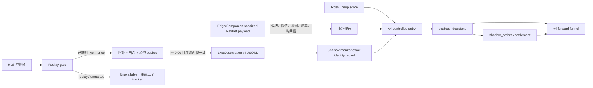

# Dota 2 翻盘策略 v4 第二阶段交接文档

## 1. 文档信息

| 项目 | 内容 |
|---|---|
| 交接日期 | 2026-07-22 |
| 仓库 | `C:\Users\59908\dota2-predictor` |
| 当前分支 | `master` |
| 当前基线提交 | `e86b17a Port dematus Rosh lineup scoring` |
| 当前策略版本 | `comeback-shadow-v4-controlled-entry` |
| 当前视觉协议 | `LiveObservation schema_version = 4` |
| 当前数据库 | `D:\dota2-predictor-cutovers\20260718-043023\restore\dota2.db` |
| 运行模式 | RayBet 只读采集 + shadow/paper order，不存在真实下注接口 |
| 代码状态 | 本轮代码尚未提交，服务尚未重启 |

本文是本轮“真实局势输入 + v4 前向评估”工作的工程交接依据。它不替代：

- 历史比赛评分交付基线：`docs/historical-intelligence-delivery-design.md`
- 监控台日常运维手册：`docs/monitoring-console-operations-manual.md`
- live betting 长期运行说明：`live_betting/README.md`

仓库根目录的 `DESIGN.md` 不是当前验收依据。

## 2. 本轮目标与实际结论

本轮按以下顺序推进：

1. 给翻盘策略增加真实局内状态输入；
2. 建立 v4 前向候选、拒绝漏斗和结算表现口径；
3. 为后续阈值与注额校准准备可用数据；
4. 暂不扩展热门方收割、通用滚球或其他策略。

已经完成的是代码和评估管线。尚未完成的是运行期样本积累和基于样本的调参。当前服务没有重启，所以正在运行的旧进程尚未加载本轮代码，也没有开始产生新的 v4 前向样本。

### 2.1 已交付

- 标准 Dota HUD 击杀读取和两帧确认；
- 标准 Dota HUD 顶部经济领先 bucket 读取和两帧确认；
- replay/highlights 画面拦截；
- v3 到 v4 的能力边界；
- bucket-only 的经济证据契约；
- Rosh 阵容方向 + 受控劣势入场门控；
- v4 候选漏斗、拒绝原因、分桶和 settled performance；
- 无效 v4 证据与全局 ROI/Brier/稳定性指标隔离；
- 固定的真实 replay/live 最小裁剪测试资产。

### 2.2 明确未交付

- 塔状态；
- Roshan/Aegis 实时状态；
- 买活状态；
- 通用广播布局支持；
- 新 v4 前向 settled 样本；
- v4 报表中的独立经济 bucket 候选/结算分层；
- 基于 v4 样本的阈值优化；
- 基于 v4 样本的注额优化；
- 真实下注能力。

这些不是遗漏。真实帧审计没有证明塔、Roshan/Aegis、买活存在稳定、持续、与导播选择无关的画面区域，因此本轮按 fail-closed 原则不实现。

## 3. 已确认的产品决策

### 3.1 策略职责

- 市场赔率只负责发现弱队候选和提供价格；
- 市场移动对模型概率的贡献固定为 `0`；
- Rosh 是阵容方向和当前时间点阵容强弱的权威；
- draft curve 只作为支持度/校准 gate，不再决定方向；
- 主路径使用选手修正后的实际阵容分；
- 缺少 player-adjusted、只有 pure draft 分时仍允许产生策略，但 `stake_multiplier` 限制在 `0.1..0.5`；
- player-adjusted Rosh 分可使用 `stake_multiplier = 1.0`；
- 重点范围仍限定为人工批准的 Tier 1 正赛；
- 所有订单都是 paper/shadow order。

### 3.2 v4 入场规则

`ComebackEntryPolicy` 当前冻结值：

| 条件 | 当前值 |
|---|---:|
| 入场时间 | 20:00 到 45:00，含边界 |
| 击杀落后 | 2 到 10，含边界 |
| 经济落后策略范围 | 1,000 到 10,000 |
| 视觉最低置信度 | 0.90 |
| 弱队赔率 | 2.50 到 12.00 |
| 最小 edge | 0.08 |
| 最低综合 data quality | 0.20 |
| 市场稳定性 | 至少两个稳定快照 |
| Rosh 方向 | 弱队概率必须大于 0.50 |

经济 HUD 显示的是千位 bucket，不是精确值。因此生产可接受范围实际上是：

- `<1k` -> `0..999`，低于策略最低经济差，拒绝；
- `1k` 到 `9k` -> 可进入受控劣势判断；
- `10k` -> `10000..10999`，上界超过策略最大 10,000，fail closed；
- 任意非标准区间，例如 `5000..5000`，拒绝；
- 精确双方 net worth 即使 JSON 结构合法，也不能作为 v4 生产证据。

### 3.3 Rosh 时间点规则

- 只选择当前游戏分钟之前或等于当前分钟的最新 Rosh bucket；
- 禁止使用未来 bucket；
- 允许真实整数分钟 bucket，例如 21、25；
- Rosh 原始 score 是 Radiant 方向，评估和分桶必须转换成 underdog 方向；
- 报表统一使用 `rosh_underdog_probability`，不能混合 Radiant/Dire 原始正负分。

任何 entry policy、Rosh 方向逻辑、证据 contract 或最终 eligible 语义的变化，都必须升级 `strategy_version`。不得在保持 `comeback-shadow-v4-controlled-entry` 名称不变的情况下修改这些规则，否则历史 v4 canonical rebuild 会发生语义漂移。

## 4. 数据流与权威边界



### 4.1 RayBet/browser payload

最近 30 个脱敏 raw-v2 artifacts 的审计结果：

- 24 个文件包含 Dota 数据；
- 29 个 Dota result 行；
- 3 个不同 match ID；
- 没有可信 `gold`、`net_worth`、`tower`、`roshan`、`aegis`、`buyback`、`kill` 或 `game_clock` 字段。

允许作为候选或路由信息：

- `result.id`、`game_id`、`status`；
- `team[].team_id/pos/team_name`；
- odds 的价格、状态、更新时间、地图阶段、队伍和市场名称；
- `manualControlData.currentIndex`，但只能作为地图候选；
- capture/observed timestamp，只用于新鲜度。

禁止作为局内实时事实：

- `score.r1/r2/r3/total`；
- `manualControlData.time`；
- `teamAScore/teamBScore`；
- 播放器 `currentTime/duration`；
- “杀敌总数”“一塔”等市场名称或盘口；
- 任意 series score。

### 4.2 Vision 是局内状态确认权威

生产 v4 只认：

- 已通过 replay gate 的画面；
- 已确认游戏时钟；
- 已确认击杀比分；
- 已确认经济领先方和 canonical bucket；
- 已确认 Radiant 对应 `team_one/team_two` 的映射；
- 置信度不低于 `0.90`。

经济领先 ROI：

| 含义 | Normalized ROI |
|---|---|
| Radiant/左侧领先 bucket | `x=.452-.478, y=.038-.055` |
| Dire/右侧领先 bucket | `x=.527-.555, y=.038-.055` |

canonical bucket 必须满足：

```text
minimum >= 0
minimum % 1000 == 0
maximum == minimum + 999
```

### 4.3 Replay/highlights gate

当前 `STANDARD_DOTA_HUD` 只支持一组由真实帧证明的正向 live marker：

```text
PLAYOFFS + QUARTERFINAL
```

判定顺序：

1. OCR 命中 `HIGHLIGHTS` 或 `REPLAY`，优先判 replay；
2. 完整命中支持的正向 marker 组合且置信度 `>=0.90`，判 live；
3. 任意普通高置信文本、单独 `PLAYOFFS`、OCR 缺失或低置信度，判 untrusted；
4. replay/untrusted 在读取时钟、击杀、经济之前重置三个 tracker；
5. 该帧只发布 unavailable 状态，不产生策略证据。

这是有意的覆盖率换安全。EPL 或其他 overlay 尚无已证明的正向 marker，因此会降级为 unavailable。扩展布局时必须先增加固定真实 crop 和测试，不能只改 OCR 白名单。

固定测试资产：

- `tests/fixtures/vision/replay_gate/highlights.jpg`
- `tests/fixtures/vision/replay_gate/live_playoffs_quarterfinal.jpg`

两张图片均为 `307x302` 的最小右上角裁剪，不依赖本机旧 evidence 路径，缺失时测试直接失败而不是 skip。

## 5. 协议与持久化

### 5.1 LiveObservation v4

新增经济字段：

```text
net_worth_advantage_side: radiant | dire | null
net_worth_advantage_min: int | null
net_worth_advantage_max: int | null
```

保留的 exact 字段仅用于旧数据解析兼容：

```text
radiant_net_worth
dire_net_worth
```

它们不能通过当前 v4 entry、monitor validator 或 report validator。

### 5.2 版本兼容

| schema | 行为 |
|---|---|
| v1/v2 | `comeback_state` 强制降级为 unavailable |
| v3 | 保留击杀，但清空 exact/bucket 经济字段；随后因缺经济证据 fail closed |
| v4 | 只允许 canonical bucket 成为生产经济证据 |
| 未知版本 | 拒绝解析 |

### 5.3 不修改 SQLite schema

本轮没有新增 `comeback_state_json` 列，没有迁移、复制、压缩或切换数据库。

HUD 状态保存在 append-only vision JSONL 和内容寻址 evidence frame 中。shadow evaluation 使用以下精确 identity，将 JSONL 状态重新绑定到 SQLite 中的 vision observation：

```text
(match_id, map_number, captured_at UTC, source_frame_ref)
```

最终策略证据保存在不可变 `strategy_decisions.contributions_json.__inputs__` 中。JSONL 损坏或 identity 冲突时，该周期 fail closed。代价是可用性下降，但不会产生缺证据订单。

当前数据库对应运行目录：

```text
D:\dota2-predictor-cutovers\20260718-043023\restore\live_betting\raw-v2
D:\dota2-predictor-cutovers\20260718-043023\restore\live_betting\live_observations
D:\dota2-predictor-cutovers\20260718-043023\restore\live_betting\live_evidence
D:\dota2-predictor-cutovers\20260718-043023\restore\live_betting\service_report.json
```

截至本轮审计，restore 中没有新的已登记 v4 frame artifact。服务重启并采到受支持直播画面后才会开始产生。

## 6. v4 前向评估报告

只读报告入口：

```powershell
$python = "$env:LOCALAPPDATA\Programs\Python\Python310\python.exe"
$database = "D:\dota2-predictor-cutovers\20260718-043023\restore\dota2.db"
& $python -m live_betting.report --database $database `
  --output "D:\dota2-predictor-cutovers\20260718-043023\restore\live_betting\comeback-report.json"
```

supervisor 运行时也会周期性写入：

```text
<database-dir>\live_betting\service_report.json
```

核心报告路径：

```text
forward_entry_by_strategy_version.comeback-shadow-v4-controlled-entry
```

包含：

- `candidate_count`；
- `entry_evidence_count`；
- `entry_evidence_invalid_count`；
- `entry_evidence_invalid_reasons`；
- `hud_confirmed_count`；
- `controlled_deficit_count`；
- `rosh_direction_pass_count`；
- `eligible_count`；
- `rejection_reasons`；
- `candidate_buckets.game_minute`；
- `candidate_buckets.kill_deficit`；
- `candidate_buckets.rosh_underdog_probability`；
- `candidate_buckets.odds`；
- `settled_performance`；
- `settled_performance.invalid_entry_order_count`；
- `settled_performance.invalid_entry_settled_order_count`。

当前报告尚未单独输出经济差候选/settled bucket。经济区间仍完整保存在 immutable decision inputs 中，并参与 eligible 判断，但在正式校准 `minimum/maximum_net_worth_deficit` 之前，必须先增加 underdog-directed 的经济 bucket 报表维度；不能只依赖手工读取单条 JSON。

隔离规则：

- strategy version 使用精确等值，不合并 v1-v3；
- malformed 或矛盾 v4 evidence 可审计，但不计入 eligible；
- invalid v4 order 不计入 v4 settled performance；
- invalid v4 order 不计入全局 ROI、Brier、结算数或稳定性；
- entry 通过但最终因 market、Rosh、draft、quality、edge 等 gate 拒绝，属于合法 rejection，不是 invalid evidence；
- identity incomplete cohort 的 stake、return、PnL、ROI 必须为空。

## 7. 运行与激活

### 7.1 当前状态

- 服务未因本轮改动重启；
- Web 未因本轮改动重启；
- 运行进程仍可能加载旧代码；
- 尚无新 v4 forward samples；
- 不需要、也不允许为本轮执行数据库迁移。

### 7.2 推荐启动命令

先确认没有另一组 managed writer 正在使用同一数据库。然后在新的 PowerShell 中启动完整 shadow 采集链：

```powershell
Set-Location C:\Users\59908\dota2-predictor
$python = "$env:LOCALAPPDATA\Programs\Python\Python310\python.exe"
$database = "D:\dota2-predictor-cutovers\20260718-043023\restore\dota2.db"
$env:STRATZ_API_TOKEN = Read-Host -MaskInput "STRATZ API token"

& $python scripts\run_dota_shadow_service.py `
  --database $database `
  --start-collector `
  --start-companion `
  --start-vision `
  --start-shadow `
  --start-strict-ingest `
  --start-postmatch `
  --start-draft-publisher
```

不要增加 `--migrate`。不要把 `STRATZ_API_TOKEN` 写入仓库、命令行参数、前端或交接文档。

另一个 PowerShell 启动 Web：

```powershell
Set-Location C:\Users\59908\dota2-predictor
$python = "$env:LOCALAPPDATA\Programs\Python\Python310\python.exe"
$database = "D:\dota2-predictor-cutovers\20260718-043023\restore\dota2.db"
& $python -m web.main --database $database
```

页面：

```text
http://127.0.0.1:8000/monitor
```

### 7.3 激活后的最低检查项

这不是浏览器 QA 清单，只是防止运行到错误数据库或旧代码：

1. Web 和 supervisor 的 `--database` 绝对路径完全一致；
2. 新 JSONL 行的 `schema_version` 为 `4`；
3. 受支持 live frame 才出现 available `comeback_state`；
4. replay/untrusted 行包含明确 unavailable reason；
5. `service_report.json` 出现当前 v4 key；
6. 不存在真实下注请求；
7. 数据库文件路径和 identity 在服务运行期间没有变化。

## 8. 测试与审查证据

本轮遵循“只跑直接相关单元测试，不做浏览器 QA 和全量重复检查”的要求。

最终相关结果：

| 范围 | 结果 |
|---|---|
| replay gate、bucket contract、schema v3/v4、entry、monitor | `72 passed`，`13 subtests passed` |
| economy 初始集成回归 | `125 passed`，`20 subtests passed` |
| v4 report P1 定向回归 | 分组运行 `3 passed`、`1 passed`、`1 passed` |
| Ruff | 通过 |
| Python compile | 通过 |
| scoped `git diff --check` | 通过，只有既有 CRLF 提示 |
| 最终跨模块只读审查 | 限定范围内无 P0/P1 |

未执行：

- 全量 pytest；
- 浏览器 QA；
- 前端页面人工验收；
- 服务重启后的运行验收；
- 新 v4 forward settlement 验收。

已知无关测试问题：`tests/test_raybet_stream_scripts.py` 的两个 supervisor fixture 仍可能因缺少后来要求的 exact team metadata 失败。该问题在本轮范围之外，不应为了让全量测试全绿而扩大修改。

## 9. 关键文件地图

| 文件 | 职责 |
|---|---|
| `contracts/live_observation.py` | schema v4、ComebackState、canonical bucket validator |
| `vision/layouts.py` | 标准 HUD 的时钟、击杀、经济和 broadcast status ROI；支持的 live markers |
| `vision/scoreboard_reader.py` | 击杀 OCR、经济 bucket OCR、replay gate、两帧 tracker |
| `scripts/watch_raybet_stream.py` | 先 replay gate，再推进 clock/kill/economy tracker，写 v4 JSONL 和 evidence |
| `live_betting/vision.py` | v1-v4 JSONL 解析、v1/v2 降级、v3 清空经济能力 |
| `live_betting/comeback_entry.py` | 受控劣势、时间窗、Rosh 方向和 bucket-only 入场 gate |
| `live_betting/comeback.py` | 最终概率、Rosh 时间点选择、其他 market/draft/quality/edge gate |
| `live_betting/shadow_monitor.py` | JSONL state exact identity rebind、Rosh 获取、决策持久化 |
| `live_betting/report.py` | v4 forward funnel、版本隔离、settled performance 和全局污染隔离 |
| `web/monitoring.py` | 页面/API 对 canonical v4 entry evidence 的只读复核 |
| `tests/fixtures/vision/replay_gate/` | 固定最小真实 replay/live crop |
| `tests/test_realtime_vision.py` | OCR、tracker、schema 和真实 fixture 测试 |
| `tests/test_comeback_entry.py` | bucket 边界、方向、exact totals 拒绝和 entry policy |
| `tests/test_live_report.py` | v4 漏斗、无效样本隔离、合法拒绝、settled/global metrics |
| `tests/test_monitoring_dashboard.py` | Web canonical evidence validator |

## 10. 工作树与提交注意事项

当前工作树包含大量本轮之前已经存在的未提交修改、已删除设计文档、日志、截图和运行产物。它们不应被本轮提交顺手清理或回滚。

本轮相关文件至少包括：

```text
contracts/live_observation.py
vision/layouts.py
vision/scoreboard_reader.py
scripts/watch_raybet_stream.py
live_betting/vision.py
live_betting/comeback_entry.py
live_betting/comeback.py
live_betting/shadow_monitor.py
live_betting/report.py
web/monitoring.py
tests/fixtures/vision/replay_gate/*
tests/test_realtime_vision.py
tests/test_raybet_stream_scripts.py
tests/test_comeback_entry.py
tests/test_live_report.py
tests/test_monitoring_dashboard.py
```

提交时：

- 禁止使用 `git add .`；
- 必须逐文件核对并精确暂存；
- 不要恢复或重新加入已经删除的旧 `docs/superpowers/specs` 文件，除非用户单独要求；
- 不要提交 `dogfood-output`、数据库、raw-v2、JSONL、evidence 或 token；
- 不要在提交过程中迁移、压缩或复制数据库。

## 11. 下一阶段执行顺序

### 阶段 A：激活并积累 v4 样本

1. 使用当前数据库原地启动 supervisor 和 Web；
2. 保持 collector、vision、shadow、postmatch 连续运行；
3. 只记录人工批准的 Tier 1 正赛；
4. 观察 candidate -> HUD confirmed -> controlled deficit -> Rosh pass -> eligible 漏斗；
5. 等待现有 postmatch/settlement 链自动结算 paper order；
6. 不因前几场结果修改阈值。

### 阶段 B：样本质量审计

重点检查：

- `entry_evidence_invalid_count` 是否持续增加；
- replay/untrusted 是否意外进入 available；
- v4 invalid order 是否始终不进入全局表现；
- 不同 underdog side 的 Rosh probability 方向是否一致；
- 1k..9k bucket 是否有足够覆盖；
- 订单是否跨多个赛事，而不是集中在一个 event。

### 阶段 C：阈值和注额校准

建议的决策纪律：

- 先给 v4 report 增加 underdog-directed 经济 bucket 候选/settled 分层，并保持 invalid evidence 隔离；
- `<100` settled orders：仅描述，不调参；
- `100..499`：可分析方向，但仍为 provisional；
- `>=500` 且至少覆盖 2 个 event，并通过 identity、bootstrap、event sensitivity 等稳定性 gate 后，才提出正式阈值/注额变更；
- 每次阈值或注额逻辑变更必须创建新策略版本，不能覆盖 v4；
- 候选分桶至少比较 minute、kill deficit、Rosh underdog probability、odds 和经济 bucket；
- calibration 和 stake sizing 必须使用 settled forward samples，不能使用 reconstructed 样本冒充前向结果。

### 阶段 D：扩展实时事实

优先顺序仍然是：

1. 新广播布局的明确 live marker 和经济 bucket；
2. 有完整 10 人映射且与顶部 bucket 交叉一致时，研究 Net Worth 榜；
3. 塔、Roshan/Aegis、买活只有在取得新鲜、内容寻址、带标签真实帧后再设计；
4. 在上述证据缺失前，不从 market name、series score 或播放器时间推断局内事实。

## 12. 交接完成标准

下一位维护者在继续开发前，应确认：

- [ ] 理解当前数据库必须原地使用，不做迁移；
- [ ] 理解 v4 尚未积累新 forward samples；
- [ ] 理解 RayBet payload 不是局内状态权威；
- [ ] 理解 exact net worth 不能重新启用；
- [ ] 理解 replay gate 当前只支持已证明的 EWC marker 组合；
- [ ] 理解 10k bucket 因上界不确定而 fail closed；
- [ ] 理解 valid entry evidence 与最终 strategy eligible 是两层 gate；
- [ ] 理解 invalid v4 样本必须从全局表现中隔离；
- [ ] 理解任何 v4 语义变化都必须提升策略版本；
- [ ] 理解当前工作树很脏，提交必须精确暂存；
- [ ] 理解当前系统只能产生 shadow/paper order。
