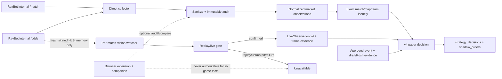

# RayBet Direct API 主采集架构设计

## 1. 文档状态与适用边界

| 项目 | 内容 |
|---|---|
| 状态 | Proposed，待评审后分阶段实施 |
| 日期 | 2026-07-23 |
| 适用系统 | Dota 2 live shadow/paper 决策链 |
| 数据提供方 | RayBet 站点内部 `/v2/match`、`/v2/odds` 接口 |
| 资金边界 | 只生成和结算 shadow/paper order，不提交真实投注 |
| 数据库边界 | 继续原地使用现有 SQLite 和配套 raw-v2 目录，不迁移、不复制、不切库 |
| 视觉协议 | `LiveObservation schema_version = 4` |

本文把 RayBet direct HTTP collection 定义为市场数据主通路，把 browser extension/companion 降为可选诊断和对照通路，同时继续把 HLS Vision 作为局内事实的唯一生产权威。

本文中的 `/match` 和 `/odds` 是 RayBet 网站当前使用的内部接口。它们不是本项目获得承诺的“官方 API”，没有公开的兼容性、可用性或 SLA 保证，文档和页面均不得把它们称为官方 API。

本文是采集和运行架构设计，不修改 v4 entry policy、Rosh 方向、draft gate、edge 阈值、stake、settlement 或策略版本语义。策略边界见 `docs/comeback-v4-phase2-handoff-2026-07-22.md`。

## 2. 背景与当前状态

当前代码不是“必须依赖扩展才能采集”的架构，direct-only 主链的大部分能力已经存在：

- `live_betting/raybet.py` 的 `RayBetClient` 使用 `curl_cffi` 直接请求 `https://cfinfo.365raylinks.com/v2/match` 和 `/v2/odds`，默认超时 20 秒，并同时检查 HTTP 状态、JSON object envelope 和 provider `code == 200`。
- `live_betting/monitor.py` 已按默认 3 秒 odds、15 秒 match list、300 秒 completed feed 周期运行 direct collector；live list 合并 `match_type=1/2`，completed list 使用 `match_type=4`。
- `live_betting/direct_response_audit.py` 已统一执行接收时间记录、payload 脱敏、immutable raw artifact、request identity 校验和接受/拒绝审计。
- `scripts/supervise_raybet_streams.py` 创建 watcher 时始终传入 `--refresh-url`。`scripts/watch_raybet_stream.py` 已能对精确 match ID 直接请求 `/odds`，在内存中取得 fresh signed HLS URL 后启动 Vision。
- `live_betting/browser_companion.py` 只有显式 `--start-companion` 才启动；未启动时 `scripts/run_dota_shadow_service.py` 已记录 `stopped / not_started_by_supervisor`。
- `live_betting/browser_ingest.py` 已把 match-list、market-update、video、manual-control 等非完整赔率事件标成 `audit_only`；只有合法的完整 odds fetch/XHR 才能进入兼容 normalization 路径。
- `live_betting/sanitize.py` 已禁止持久化 token、signature、cookie、signed query 等敏感材料，只允许带 writer-owned provenance 的已验证 unsigned public HLS URL 长期存储。

因此本设计不是新建一条采集链，而是完成以下增量调整：

1. 明确 source policy：direct 是 paper 决策的主市场来源；
2. 让 companion 的 stopped 状态不再降低 direct-only 决策 readiness；
3. 把 browser 数据限定为可选审计、协议变化诊断和双路对照；
4. 将 HLS 获取、Vision 生产能力和逐场决策 readiness 表达得更准确；
5. 通过灰度和指标证明关闭扩展后链路仍可持续运行。

当前仍有一个必须先修复的 source 隔离缺口：`live_betting/shadow_monitor.py` 的 current/previous transport 查询，以及 `live_betting/storage.py` 的 processed watermark、first successor 和 fill 查询都未过滤 `odds_transport_observations.source`；`trusted_odds_winner_market_authority` 本身也未限定 direct。只要 dual-observe 接收了一条合法完整 browser odds，较晚的 browser observation 就可能成为 signal、推进 pending order watermark，或被选成 first successor/fill。关闭 companion 可以暂时避免新 browser observation，但不能证明历史库和未来诊断模式不会污染生产读取。

## 3. 目标与非目标

### 3.1 目标

1. 无 browser extension、无 companion 进程时，系统仍能完成：赛事发现、赔率采集、HLS 刷新、Vision、v4 paper decision、shadow fill/reject 和赛后结算。
2. 每个用于决策的 RayBet 响应都能绑定到精确 endpoint、canonical request identity、receipt time、HTTP/provider 状态、不可变脱敏 artifact 和 audit row。
3. API payload 只提供市场和路由事实；游戏时钟、击杀、经济 bucket、replay/live 状态和 Radiant side 继续只接受可信 Vision。
4. provider 或 Vision 异常时 fail closed，不用 browser 页面字段、旧 HLS URL或市场名称猜测局内状态。
5. 保持现有 SQLite、raw archive、odds observation、decision evidence 和历史报表兼容。

### 3.2 非目标

- 不实现真实下注、账户登录、订单提交或资金管理。
- 不承诺 RayBet 内部接口长期稳定，也不绕过认证、访问控制、验证码或反自动化机制。
- 不把 `manualControlData.time`、series score、播放器进度或盘口名称升级为局内事实。
- 不扩大 Vision 支持的 broadcast layout，不降低 replay gate 或 `0.90` 置信度门槛。
- 不修改 comeback v4 策略语义或用本次 source 切换重算历史收益。
- 不在本阶段删除 extension、companion、`browser_events` 或 browser-compatible storage。

## 4. 设计原则

1. **权威按事实类型划分**：市场事实来自 direct RayBet response；局内事实来自 HLS Vision；赛事批准和 exact mapping 来自既有严格治理链。
2. **接收证据先于业务处理**：response 必须先脱敏、归档并核对 transport receipt，再允许 normalization。
3. **身份优先于可用性**：requested match、observed match、game ID、team ordering 或 map identity 不精确时拒绝，不做 fuzzy 修复。
4. **敏感 URL 短生命周期**：fresh signed HLS URL 只在 watcher 进程内使用，永不落 SQLite、JSONL、日志、artifact 或前端。
5. **停止可选组件不是故障**：未配置 companion 是预期运行模式，不得等价为主链降级。
6. **生产读取全程同源**：browser observation 不在 direct 故障时静默成为 candidate、current/previous signal、watermark、successor、fill、settlement 或 report authority，以免来源发生不可见切换。
7. **每场 fail closed，全局可部分服务**：一场 identity/HLS/Vision 失败只阻止该场决策；其他证据完整的比赛继续运行。
8. **可观测指标必须先可测**：尚无字段或采样出口的 TTL、latency、backoff 指标只能标为待实施，不得先声明已达到 SLO。

## 5. 权威矩阵

| 事实/能力 | 生产权威 | 可选对照 | 明确禁止 |
|---|---|---|---|
| live/completed 赛事发现 | direct `/match` | browser match-list audit | DOM 文本推测 |
| match ID、game ID、队伍 ID/pos、status、BO | direct `/odds`，并与 `/match` 候选交叉校验 | browser 完整 odds payload | name-only/fuzzy identity |
| 市场组、outcome、price、market status、provider update | direct `/odds` immutable response | browser 完整 fetch/XHR 仅作 shadow compare | 从页面展示文本补字段 |
| transport time | direct response `received_at` | browser `captured_at` 仅属自身通路 | provider 非可信业务时间替代接收时间 |
| 当前 map 候选 | direct payload 的严格 `currentIndex`/既有唯一推断 | 人工 `--map-number` 调试 | 把候选直接当局内确认 |
| HLS 地址 | direct `/odds` fresh response，仅内存使用 signed URL | 已验证 unsigned URL 可作启动提示；browser video 仅诊断 | 持久化 signed query 或任意 host URL |
| live/replay/highlights | Vision replay gate | 无 | API status、播放器状态 |
| 游戏时钟/暂停 | confirmed Vision | 无 | `manualControlData.time`、player currentTime |
| 击杀比分 | confirmed Vision | 无 | `score.r*`、teamAScore/teamBScore、kills market |
| 经济领先方和 canonical bucket | confirmed Vision v4 | 无 | 赔率、让分盘、exact net worth 猜测 |
| Radiant 与 team_one/team_two | confirmed Vision side mapping + exact identity | 无 | 队名顺序猜测 |
| 策略 candidate/current/previous transport | `source='direct'` production projection | browser 独立 compare projection | 跨来源选最新或拼两快照 |
| trusted winner market authority | direct transport + immutable response authority | browser authority 仅作差异报告 | 未核对 source 的通用 authority |
| pending watermark/successor/fill | direct processed transport | browser 不推进 watermark | browser later/current/first-successor |
| 策略 eligibility | v4 strategy + 全部 immutable direct market inputs | 无 | 任一缺失证据的人工补齐 |
| readiness/settlement/report | 只统计 direct production projection；结算继续使用 direct final audit | browser 单列诊断指标 | 把 browser 新鲜度或结果算入主链 |

## 6. 目标组件架构与数据流



主数据流为：

1. collector 从 `/match` 分页发现 Dota 2 候选，只接受 `game_id == 151` 且数字 match ID。
2. 对每个 match ID 请求 `/odds`，核对 observed match ID、game ID 和 head-to-head identity。
3. response 经脱敏和 immutable audit 后，转换为 `source='direct'` 的 `odds_transport_observations`、response state 和 odds snapshots。
4. Vision supervisor 从精确 live match row 选出 watcher；browser video evidence 只能标注发现理由，不是 probe gate。
5. watcher 使用 `/odds?match_id=<exact-id>` 刷新 HLS，验证 host/scheme/port/path 后在内存打开。
6. Vision 通过 replay gate 和连续帧 tracker 后发布 v4 JSONL/evidence。
7. shadow monitor 只从 direct production projection 选择 current/previous transport，并把 exact mapping、Vision、draft/Rosh 和策略 gate 绑定后生成 paper decision。
8. pending order 的 processed watermark、first successor、fill、settlement和 report lineage 都只允许沿 direct transport 前进；browser 使用独立 compare projection，不参加生产状态机。

## 7. Direct API、Transport Identity、审计与脱敏

### 7.1 Endpoint contract

| 操作 | Endpoint | 参数 | 周期默认值 | response_kind |
|---|---|---|---|---|
| live list | `/v2/match` | `match_type=1/2&page=N` | 15 秒刷新列表，最多 10 页/类型 | `live_match_list` |
| completed list | `/v2/match` | `match_type=4&page=N` | 300 秒 | `completed_match_list` |
| live odds | `/v2/odds` | `match_id=<id>` | 每轮默认 3 秒 | `live_odds` |
| completed odds | `/v2/odds` | `match_id=<id>` | 跟随 completed refresh | `completed_odds` |
| HLS refresh | `/v2/odds` | `match_id=<exact-id>` | watcher 启动/重试时 | `live_odds` + operation metadata |

默认周期来自 `live_betting/monitor.py`，不是 provider SLA。当前最大 300 秒 exponential backoff 只覆盖逃逸到外层的整轮异常；单场 `/odds` 错误会在下一轮再次请求。实际部署还需实现第 12.2 节的 per-match/endpoint backoff。

### 7.2 Transport identity

对每个请求必须记录并验证：

- `endpoint`：持久化 absolute endpoint，例如 `https://cfinfo.365raylinks.com/v2/odds`，不含 query；
- `request_identity`：absolute endpoint 加 canonical query，例如 `https://cfinfo.365raylinks.com/v2/odds?match_id=42`；
- `received_at`：HTTP response 在本机接收完成的 timezone-aware UTC 时间；
- `request_started_at` 和 `transport_duration_ms`：待实施，分别用于审计起点和 monotonic duration；
- `http_status` 和 provider `code`，两者分别判断；
- `receipt_id`：每次 audited request 的唯一 metadata；
- `audit_key`、artifact hash 和业务 `observation_key`。

`request_identity` 表示“请求了什么”，不是每轮唯一 observation。direct observation key 继续由 exact match ID、`received_at` 和 sanitized payload fingerprint 派生；因此相同 endpoint 的两个真实接收轮次仍是不同 transport observation，能满足策略对两个未复用 transport key 的稳定快照要求。

表格里的 `/v2/match`、`/v2/odds` 只是便于阅读的展示路径。实现不得把相对路径写入 receipt；否则会与 `RayBetClient` 产生的 absolute identity 不一致并触发 `request_identity_mismatch`。expected/actual endpoint 或 request identity 不一致时必须写 rejection audit，且不得进入 normalized state。claimed/observed match ID、`game_id` 或 payload shape 不一致时同样拒绝。

### 7.3 Immutable audit

沿用 `audited_direct_request()` 的固定顺序：

```text
fetch -> receipt metadata -> sanitize -> content-addressed gzip artifact
      -> receipt identity/payload-shape check
      -> transactional validate/process + normalized observation + direct_response_audit
```

成功路径中的业务写入和 accepted/audit-only row 位于同一事务；处理失败时该事务回滚，再单独记录 rejected audit。因此不会出现“normalization 已提交但 success audit 缺失”的半完成状态。

HTTP 错误但返回可解析 provider payload时仍归档脱敏 response；网络/JSON 失败写 bounded failure artifact。payload 深度、节点数或 artifact 尺寸超限时只写有界 failure receipt，不把超限内容部分落库。相同内容可以复用 artifact，但每次 receipt 必须保留独立 audit row。

### 7.4 Sanitization

继续使用 `live_betting/sanitize.py`：

- 删除 key 名中包含 authorization、token、secret、session、cookie、signature、jwt 等内容；
- URL 长期存储只保留 scheme/authority/path，清除 query 和 fragment；
- `live_url` 只有在 `https`、允许的 public stream host、`.m3u8`、无 query/fragment/userinfo 且带 writer-owned provenance 时才可作为 unsigned URL 存入 match row；
- fresh signed HLS URL 在 sanitize 前仅供当前 watcher 使用，audit artifact 中只能出现清除 query 后的版本；
- 日志、exception、health details 和前端均不得输出完整 signed URL。

这里存在 native backend 边界：signed URL 会传入 OpenCV/FFmpeg。即使 Python 代码不打印 URL，native open/read failure 仍可能把完整地址写到进程 stderr，并被 supervisor 收进 watcher log。实施 direct-only 前必须在 watcher 进程禁用或重定向 OpenCV/FFmpeg 网络诊断，Python exception 也只能输出错误分类和 sanitized host/path。不能只依赖 `sanitize_raybet_payload()`，因为 native stderr 不经过该函数。

## 8. HLS URL 获取与刷新

### 8.1 现有能力

`scripts/supervise_raybet_streams.py::watcher_command()` 已固定加入 `--refresh-url`。`scripts/watch_raybet_stream.py::_fresh_stream_payload()` 已通过 audited direct `/odds` 获取 exact match 的 `result.live_url`，检查 match ID、Dota game ID 和 allowlisted stream host。direct-only 模式不需要 companion 才能取得 fresh signed HLS。

### 8.2 目标刷新规则

1. watcher 启动前总是 fresh fetch，不把数据库中的旧 signed URL当首选。
2. signed URL 只传给当前 `HLSStreamCapture` 对象，不写数据库或命令行。
3. open/read 因 401、403、404、playlist expired 或连续读取失败退出时，由 supervisor 现有 30/60 秒 bounded retry 重新启动 watcher并重新 fetch；三次启动失败后 `retry_exhausted`。
4. 后续如在 watcher 内增加热刷新，只能替换 capture，不得复用上一次 query，不得跳过新 response audit。
5. `/odds` 成功但 `live_url` 缺失、host 不允许、identity 冲突或 map number 不唯一时，该场 Vision unavailable，禁止使用 browser 播放器 URL 静默接管。
6. native backend open/read 失败只能记录 `hls_open_failed`、`hls_read_failed` 等有界 reason；必要时在进入 backend 前设置 silent log level，并在 watcher 单进程边界重定向原生 stderr。不得把含 URL 的 native message 转发到 watcher stdout/stderr。

`active_match_evidence()` 中的 `verified_public_stream`、`fresh_browser_video`、`ephemeral_stream_refresh_probe` 只描述 watcher 为什么被关注。目标语义下 browser evidence 不构成启动前置条件；精确的 live Dota row 可以直接进入 ephemeral refresh probe。

## 9. Vision 权威边界

Vision 继续遵守 `docs/comeback-v4-phase2-handoff-2026-07-22.md`：

- API 的 `status` 只能帮助选择 live 候选，不能证明当前帧不是 replay。
- 只有 replay gate 证明为 live 的帧才读取并确认时钟、击杀和经济 bucket。
- replay/untrusted 帧重置 clock、scoreboard、advantage tracker，并发布明确 unavailable reason。
- 时钟、击杀、经济需要当前帧证据、连续两帧确认和不低于 `0.90` 的置信度。
- canonical 经济区间必须满足 `minimum >= 0`、`minimum % 1000 == 0`、`maximum == minimum + 999`。
- Vision JSONL 与 SQLite 继续用 `(match_id, map_number, captured_at UTC, source_frame_ref)` exact rebind；冲突或损坏 fail closed。

API schema 增加任何类似 clock、kill 或 score 字段都不能自动改变此权威矩阵。升级权威必须另写设计、取得真实标注证据、增加固定 fixture，并按需要升级策略版本。

## 10. Browser Extension/Companion 的可选角色

### 10.1 允许用途

- 对照 direct payload 与网站实际 fetch/XHR，发现 endpoint/schema 变化；
- 审计页面在某场比赛是否仍产生 video 请求；
- 诊断 direct collector 失败是 provider 整体故障还是 direct client 兼容问题；
- 在 dual-observe 灰度期间比较 normalized state hash、价格、市场状态和接收延迟；
- 开发/测试 browser contract、CORS、origin、rate-limit 和脱敏防线。

### 10.2 禁止用途

- 作为 direct-only paper 决策 readiness 的必要组件；
- 用 video/manual-control/page-state 提供时钟、击杀、经济或 replay/live 事实；
- direct 失败后自动接管生产 paper signal；
- 将 DOM、页面播放器时间或 partial market update 填充成完整 odds response；
- 因 companion stopped 让 collector 或 Vision 被标成 unavailable。

### 10.3 生产 source 隔离

现有 `browser_events` 和 `source='browser'` observation 保留兼容。本设计选择两套明确投影：

- **production projection**：所有市场状态查询显式要求 `odds_transport_observations.source='direct'`；
- **browser compare projection**：只供 direct/browser state divergence 报告，不能返回 production transport key。

source policy 必须覆盖完整生命周期，而不只是最终 eligibility：

1. 赛事 candidate 的当前 transport；
2. current/previous 两个稳定快照和 Vision 对齐 cutoff；
3. `trusted_odds_winner_market_authority` 的生产使用；
4. `strategy_decisions.signal_transport_key` 和 `vision_transport_key`；
5. pending order 的 processed watermark、first visible successor、outcome lookup 和 fill transport；
6. readiness 的 odds freshness/current state；
7. settlement lineage、ROI/return、service report 和 Web replay。

实施时应给 `live_betting/shadow_monitor.py` 的 ranked/current transport CTE 和 `_transport_refs()`，以及 `live_betting/storage.py` 的 `next_fill_candidate()`、`processed_transport_watermark()`、`process_pending_successor()`、signal/market authority validation 增加 direct 约束；同样审计 settlement/report/Web 的全部 transport join。仅在 eligibility 最后一层检查 source 太晚，因为 browser observation 可能已经推进 watermark 或决定 first successor。若未来确需 browser fallback，应单独设计显式开关、告警、来源标记、独立校准和策略版本，不在本设计内自动启用。

## 11. Supervisor Readiness 语义

### 11.1 组件健康与决策就绪分离

组件健康回答“进程/通路是否按配置工作”；逐场 readiness 回答“这场比赛现在是否具备发起 paper decision 的证据”。两者不得混成一个总灯。

| 组件 | 未配置 | 已配置且正常 | 异常对 direct-only 的影响 |
|---|---|---|---|
| collector/raybet | `stopped` | collection fresh | P0，所有新市场决策 fail closed |
| vision supervisor | `stopped` | idle 或全部所需 watcher producing | live 比赛无局内证据，逐场 fail closed |
| shadow | `stopped` | heartbeat fresh | 不产生新 paper decision |
| companion | `stopped/not_started_by_supervisor` | reachable | `informational`，不降低 direct-only readiness |
| strict ingest/draft publisher/postmatch | 按现有配置语义 | heartbeat fresh | 只影响依赖它们的 gate/settlement |

`vision_worker=healthy, reason=idle` 在没有 exact live match 时是正确状态；有 desired watcher 时才要求 producing。queued watcher 是容量降级，retry exhausted 是对应比赛不可用，不应伪装成全链健康。

### 11.2 建议的能力状态

在不改 schema 的前提下，可由 service report/Web API 动态派生：

- `market_primary`: direct collector heartbeat、最近成功 direct 采集、无新近主请求错误；browser freshness 不参与；
- `stream_acquisition`: 该场最近 HLS refresh audit 或 watcher retry 状态；
- `vision_facts`: 该场 fresh confirmed v4 observation；
- `browser_diagnostics`: disabled/healthy/degraded，仅信息状态；
- `decision_ready`: direct market + mapping + Vision + draft/Rosh + strategy worker 的合取。

页面的“异常进程”统计必须根据 desired/configured components 计算。未配置 companion 不能增加异常数、不能产生 P0/P1 告警，也不能把 `decision_ready` 从 true 变为 false。

## 12. 故障、降级与 Fail-Closed

| 故障 | 可继续能力 | 必须阻止 | 状态/证据 |
|---|---|---|---|
| `/match` 暂时失败 | **待实施 TTL 后**可在 60 秒内继续拉取 cache 中 match 的 `/odds` | 新比赛发现；cache 超过 TTL 后新决策 | 当前实现会跳过本轮，不存在正式 TTL；目标为 degraded + immutable failure audit |
| 单场 `/odds` 失败 | 其他比赛继续 | 该场新 market observation/decision | 当前每 3 秒重试；目标为 per-match/endpoint backoff |
| HTTP 200、provider code 非 200 | 无 | normalization、HLS 获取 | rejected provider response audit |
| response identity/schema 不符 | 无 | normalization、HLS 获取 | `identity_mismatch`/`validation_failed` |
| payload/artifact 超限 | 无 | 部分解析或截断使用 | bounded `payload_limits_exceeded` receipt |
| collector stale > 60 秒/120 秒 | 历史查看 | 新 paper decision | degraded/unhealthy，沿用现有阈值 |
| HLS URL 缺失/过期/host 非 allowlist | 市场采集 | 该场 Vision 和 decision | watcher retry；最终 exhausted |
| HLS 可读但 replay gate untrusted | 市场采集、frame audit | 局内事实和 decision | v4 unavailable reason |
| Vision output stale | 市场采集 | 该场 decision | watcher `output_stale` |
| companion 未启动 | 全部 direct-only 主链 | 无 | informational stopped |
| companion 已配置但异常 | direct-only 主链 | browser compare | browser diagnostic alert |
| browser observation 比 direct 更晚/成为 first successor | direct 状态机继续 | browser 推进 current、watermark 或 fill | source isolation violation，critical |
| direct/browser 值冲突 | direct 仍为主，但产生高优先级数据质量告警 | 不允许 browser 覆盖 direct | compare projection，必要时人工停用该场 |

所有降级均禁止读取“最后一次已知”时钟或赔率来伪造新鲜决策。已有 pending shadow order 的 successor fill 和结算继续遵守各自现有 transport/freshness 契约，不因 browser 状态改变。

### 12.1 待实施 live-list TTL

当前 `live_betting/monitor.py` 在 live `/match` refresh 抛错时进入外层 exception，本轮不会继续对旧 `list_rows` 拉取 `/odds`；文档此前提到的“短新鲜度内继续”尚未实现。目标采用进程内 `LiveListCache(rows, fetched_at_utc, expires_at_monotonic)`：

- 成功 list response 原子替换 cache，TTL 固定为 60 秒；
- list 失败且 cache 未过期时，只轮询 cache 中的 exact match ID，collector 标 degraded；
- cache 过期或进程重启无 cache 时，不再发起基于旧 list 的新决策；
- cache 不落数据库，不用 wall-clock 回拨延长 TTL；
- 60 秒是本设计初始值，canary 后只能通过配置评审调整，不能隐式沿用 collector freshness 阈值。

### 12.2 待实施 per-match/endpoint backoff

当前单场 `/odds` 错误被 `collect_once()` 捕获并计数，外层 `failures` 随后清零；`--max-backoff` 只覆盖整轮异常，持续 429/5xx 的单场仍会每 3 秒重打。目标为每个 `(endpoint, canonical request identity)` 维护进程内失败状态：

```text
consecutive_failures, retry_not_before_monotonic,
last_http_status, last_provider_code, last_failure_reason
```

网络错误、429 和 5xx 使用 `min(300s, 3s * 2^(n-1))` 延迟，其中 `n` 从 1 开始；到期后允许一个 probe，成功即清零，match 从 live list 消失时删除状态。一个 match 的 backoff 不阻塞 list refresh、其他 match odds 或 completed feed。时钟必须可注入并以 monotonic time 判定，测试不得真实 sleep。身份/schema rejection 另行触发 data-integrity 告警，不能靠高频重试恢复。

## 13. 数据模型兼容与无需迁移

本设计不需要 SQLite migration，原因如下：

- `direct_response_audit` 已记录 endpoint、request identity、HTTP/provider status、metadata、disposition、reason 和 artifact hash，且有 immutable trigger；
- `odds_raw_artifacts` 已是内容寻址、不可变、`source='raybet'` 的外部 gzip registry；
- `odds_transport_observations.source` 已支持 `direct` 和 `browser`，每个 observation 有独立 key、时间、state/artifact binding 和 timing status；
- `raybet_matches`、odds response states/snapshots 和 activity 表不绑定 browser 才能工作；
- `browser_events` 可原样保留历史和诊断数据；
- `service_health.details_json`、service report 和 Web API 可以承载新增的 derived capability/status，无需加列；
- `direct_response_audit.request_metadata_json` 可承载待新增的 `request_started_at` 和 `transport_duration_ms`，无需新增列；
- Vision v4 继续在 append-only JSONL 和内容寻址 frame 中持久化；策略 inputs 继续写 immutable decision contributions。

实施时可以调整读取策略、已有 view 的应用侧使用、health/audit metadata、启动文档和可观测性，但不新增表/列、不重写数据。不得为本设计复制数据库、压缩数据库、修改 database identity 或重写已有 browser observation 的 source。若选择修改持久化 view/trigger DDL 来做 source enforcement，则不再属于本设计的“无需迁移”路径，必须另行走数据库协议评审；本设计默认使用 explicit query/validation filters。

## 14. 运行模式与配置

### 14.1 `direct-only`，默认生产 paper 模式

```powershell
& $python scripts\run_dota_shadow_service.py `
  --database $database `
  --start-collector `
  --start-vision `
  --start-shadow `
  --start-strict-ingest `
  --start-postmatch `
  --start-draft-publisher
```

不传 `--start-companion`。collector、Vision 和 shadow 仍必须显式启动；历史 Rosh 保持现有默认行为。`STRATZ_API_TOKEN` 等既有配置继续只通过进程环境/secret store 注入。

### 14.2 `dual-observe`，灰度和诊断模式

在上述命令增加 `--start-companion` 并启用扩展。只有完成第 10.3 节的全生命周期 source 隔离后，才能同时运行 shadow；此前 dual-observe 只能用于 audit/compare，不得启动生产 paper decision。生产验收不要求长期运行此模式。

### 14.3 `audit-only`

只启动 collector 和可选 companion，用于协议检查和 raw artifact 审计，不启动 shadow 时不会生成 decision。Vision 可单独开启验证流覆盖。

当前 CLI 尚无显式 `--market-source-policy`。实施阶段建议增加配置层或固定 direct-only selector，并在 service report 暴露 `market_source_policy=direct_primary`。不启动 companion 只能阻止新的 browser observation，不能隔离数据库里已有的 browser transport；全生命周期 direct filters 完成前，必须先证明目标数据库不存在可进入 current/successor 窗口的 browser observation，否则停止 shadow 决策。

## 15. 灰度迁移步骤

1. **基线冻结**：记录当前 direct/browser 每分钟成功量、错误率、odds state 差异、HLS refresh 成功率、Vision producing 比例和 decision funnel；不调整 v4 阈值。当前不可测的 request latency 不填假值。
2. **source 隔离**：给 candidate/current/previous、trusted market、watermark/successor/fill、readiness、settlement/report 的生产查询统一增加 explicit `source='direct'`；browser 建立独立 compare projection。
3. **采集韧性与可观测性**：实现 60 秒 `LiveListCache`、per-match/endpoint monotonic backoff，以及 `request_started_at`/`transport_duration_ms` audit metadata 和指标出口。
4. **native secret 防线**：禁用或重定向 OpenCV/FFmpeg 网络诊断，用唯一 marker 故障测试证明 signed query 不进入任何日志或持久层。
5. **双路观察**：短期运行 companion，但 production selector 只读取 direct；验证同 match/map/market 的状态 hash 和价格差异，查清非零差异，并确认 browser later/current/first-successor 不改变 decision/fill。
6. **readiness 调整**：把 companion 标为 optional diagnostic；增加未配置 companion 不计异常的测试和页面验收。
7. **direct-only canary**：选择 1 场人工批准、Vision layout 受支持的 Tier 1 直播，完全关闭扩展，跑通 `/match -> /odds -> HLS -> Vision v4 -> decision/rejection -> settlement`。
8. **扩大覆盖**：连续至少 3 个 series 或 24 小时运行 direct-only，确认 list pagination/TTL、429/5xx backoff、HLS expiry/restart、completed refresh 和服务重启恢复。
9. **设为默认**：更新 README/运维手册和标准启动脚本，去掉推荐命令中的 `--start-companion`，但保留诊断说明。
10. **观察期**：至少 7 天保留 browser 可随时人工启用，持续看 schema fingerprint、provider errors 和 missing market coverage；不自动 fail over。

每一步失败都回到上一种运行模式，不回写历史数据，不修改策略版本，不以 browser observation 冒充 direct receipt。

## 16. 监控、SLI 与 SLO 建议

由于内部接口无官方 SLA，以下 SLO 是本项目自身的运行目标，不是 provider 承诺。标为“待实施”的 SLI 在字段和出口完成前不得进入 SLO 合规报表。

| SLI | 建议 SLO/告警 |
|---|---|
| direct list success ratio | 15 分钟滚动 >= 99%；连续 2 次失败 warning；**60 秒 TTL 待实施**，过期 critical |
| per-match `/odds` success ratio | 15 分钟滚动 >= 99%；按 match ID 分组 |
| direct request transport latency | **待实施**；p95 < 2 秒，p99 < 5 秒 |
| per-match backoff effectiveness | **待实施**；429/5xx backoff 期间重复请求为 0，其他比赛继续采集 |
| live odds freshness | p95 < 10 秒；> 60 秒 degraded，> 120 秒 unhealthy/decision blocked |
| request identity mismatch | 0；任意一次 critical data-integrity alert |
| payload limit/shape rejection | 0 基线；任意新增 schema fingerprint 触发 warning |
| HLS fresh URL acquisition | 5 分钟滚动 >= 95%；三次 retry exhausted per-match critical |
| desired watcher producing | 有容量时 >= 99%；90 秒无当前输出 unhealthy |
| confirmed Vision freshness | 对支持布局的 live match，p95 < 20 秒；> 120 秒 blocked |
| browser dependency violations | 0：direct-only 中不得出现 browser source decision input |
| direct/browser state divergence | dual-observe 中按 exact market 统计；非零持续 2 轮 warning |
| end-to-end decision cycle | 输入齐全后 p95 < 15 秒；分别统计 eligible 与合法 rejection |

必须按 endpoint、response_kind、match ID、HTTP status、provider code、rejection reason 和 watcher reason 分维度。指标和日志只能包含 sanitized endpoint/request identity，不包含 signed HLS query。

request latency 当前不可测：`RayBetHTTPResponse` 只有请求返回后的 `received_at`，没有 start 或 duration。目标在调用 `Session.get()` 的前一刻记录 timezone-aware `request_started_at` 和 monotonic start，在完整 response body 返回后、JSON parse 前记录 `received_at` 与 `transport_duration_ms`。duration 使用 monotonic clock 计算，UTC 时间只作审计；JSON parse/normalization/audit 时间不计入 transport latency。字段写入现有 `direct_response_audit.request_metadata_json`，并按 endpoint/response_kind 聚合到 collector `service_health.details_json` 和 Web 系统 API。异常路径也必须记录相同起止定义。

## 17. 测试矩阵

| 层级 | 场景 | 期望 |
|---|---|---|
| RayBet client | HTTP error、invalid JSON、non-object、provider code 非 200、timeout | 带精确 receipt metadata 失败，不返回业务 payload |
| request identity | query 顺序等价、endpoint/query 不匹配、错误 match ID | 等价 canonicalize；不匹配 audit 后拒绝 |
| sanitization | token/signature/cookie key、signed URL、恶意 host、深度/节点上限 | secret 不落盘；超限写 bounded failure |
| direct audit | 重复内容、多次 receipt、accepted/rejected/audit_only | artifact 可去重，receipt/audit 不丢失 |
| normalization | Dota/non-Dota、H2H/非 H2H、完整/部分 market、late response | 仅合法 direct observation 进入可用 timeline |
| source policy / signal | browser 比 direct later/current；browser 与 direct 同值/冲突 | candidate、current/previous、decision keys 只引用 direct |
| source policy / fill | browser 成为时间上的 first successor、browser 缺 outcome/价格冲突 | watermark 不被 browser 推进；first successor 和 fill 只引用 direct |
| source policy / downstream | browser 更新 readiness、settlement/report cutoff | 主 freshness、结算 lineage 和表现报告只引用 direct |
| live-list TTL | 注入 monotonic clock；成功后 list 失败，分别处于 59/60/61 秒；进程重启 | TTL 内轮询 cached exact IDs，过期/重启无 cache 时阻止；health degraded |
| endpoint backoff | 单场持续 429/5xx、其他场成功、时钟前进、probe 成功 | 失败场不每 3 秒重打；其他场不受阻；到期 probe；成功清零 |
| request latency | 成功/HTTP error/timeout 的 fake wall + monotonic clocks | metadata 起止完整、duration 非负，health/Web 聚合一致 |
| HLS refresh | fresh signed URL、缺 URL、过期、身份错、host 错、provider failure | signed URL 仅内存；失败逐场 fail closed |
| signed URL marker 泄漏 | 用唯一 query marker 触发 native OpenCV/FFmpeg open/read failure | Python stdout/stderr、watcher logs、`service_health`、artifact、SQLite、Web API 均无 marker |
| Vision supervisor | idle、starting、producing、queued、stale、retry/backoff/exhausted | health/reason 与状态机一致 |
| Vision authority | live/replay/untrusted、两帧确认、低置信度、canonical bucket | 只有可信 v4 observation 可进入 entry |
| readiness | companion disabled/healthy/unhealthy；collector stale；Vision stale | disabled 不影响主链，必需组件异常阻止决策 |
| E2E | 关闭 extension 的受支持 live fixture/真实 canary | direct API 到 paper decision/rejection 全链可审计 |
| restart | collector、watcher、supervisor 重启及 HLS expiry | 不复用旧 signed URL，不重复/篡改 observation |
| settlement | completed list/odds 和 existing pending order | 保持既有 exact final authority 与结算兼容 |

重点复用并扩展：

- `tests/test_raybet_direct_response_audit.py`
- `tests/test_raybet_sanitization.py`
- `tests/test_raybet_stream_scripts.py`
- `tests/test_browser_ingest.py`
- `tests/test_browser_companion.py`
- `tests/test_service_health.py`
- `tests/test_live_betting.py`
- `tests/test_realtime_vision.py`
- `tests/test_shadow_monitor_safety.py`

## 18. 验收标准

全部条件同时满足才可把 direct-only 设为标准运行模式：

1. 标准启动命令不含 `--start-companion`，supervisor 和 Web 指向同一现有数据库。
2. companion 显示 `stopped/not_started_by_supervisor`，但主链无异常计数、无 companion P0/P1 告警。
3. direct `/match` 和 `/odds` response 都有 sanitized immutable artifact、精确 receipt audit 和 normalized direct observation。
4. candidate/current/previous、trusted market、decision、processed watermark、first successor、fill、readiness、settlement 和 report lineage 的 transport key 均来自 `source='direct'`；两个稳定快照 key 不复用。注入更晚 browser current/first-successor 或冲突价格后，decision/fill 不变且 watermark 不前进。
5. watcher 通过 direct `/odds` 获得 fresh HLS；唯一 marker 故障注入后，Python stdout/stderr、OpenCV/FFmpeg native stderr、watcher logs、`service_health`、artifact、SQLite 和 Web API 中均搜索不到 signed query secret。
6. 在受支持直播中产生 fresh confirmed schema v4 observation；replay/untrusted 始终 unavailable。
7. 至少一场人工批准比赛跑通 candidate -> direct odds -> HLS -> Vision -> v4 strategy decision（eligible 或证据完整的合法 rejection）。
8. live `/match` 失败时 60 秒 cache TTL 行为由 monotonic clock 测试证明；TTL 过期后不继续用旧 list 发起新决策。
9. 单场持续 429/5xx 进入 per-match/endpoint backoff，不每 3 秒重打、不拖累其他比赛；成功 probe 可恢复。
10. 成功和失败请求均记录同一定义的 `request_started_at`/`transport_duration_ms`，endpoint 指标可从 service health/Web API 读取。
11. provider、identity、HLS 或 Vision 故障注入均逐场 fail closed，其他比赛不受牵连。
12. completed feed 和现有 shadow settlement/report 回归通过。
13. 无 SQLite 表/列 migration、无 database identity 变化、无历史 observation 重写。

注意：验收 direct-only 采集能力不等于证明策略盈利，也不要求为迁移制造 eligible 信号；合法 rejection 同样可以证明链路运行，但正式策略能力仍需前向样本和校准。

## 19. 回滚方案

1. 保持现有 browser 代码和表结构，不删除扩展。
2. 若 direct-only readiness/source selector 引入回归，回滚应用代码和启动配置到上一版本；数据库无需回滚。
3. 可重新加 `--start-companion` 恢复 dual-observe 诊断，但 browser 不自动成为决策主源。
4. 若 RayBet 内部 endpoint/schema 变化，停止新 paper decision，保留 collector failure audit和历史查看；先更新 client/validator/tests，再恢复。
5. 若 HLS direct refresh 单独失败，可暂停 Vision/decision 并保留市场采集；不得把未知 browser video URL手工写入数据库绕过校验。
6. 回滚前后都使用同一 database/raw archive pair，禁止复制旧数据库覆盖运行库。

## 20. 风险、授权与合规

- `/match`、`/odds` 和 HLS 是站点内部接口，没有官方 SLA，可能无通知改变域名、字段、provider code、限流或签名方式。
- 直接技术可访问不等于获得使用授权。上线持续采集前需确认 RayBet 条款、当地法律以及赛事数据和直播画面的使用权。
- 不得绕过登录、验证码、地区限制、访问控制、付费墙或技术保护措施；出现此类要求时停止并升级人工审查。
- `curl_cffi` impersonation 是当前兼容实现，不构成稳定协议。异常封禁或挑战必须 fail closed，不得升级为更激进规避。
- HLS URL 即使指向 public host 也可能是短期 bearer capability，必须按敏感信息处理。
- OpenCV/FFmpeg native backend 可能绕过 Python sanitizer 把 signed URL 写到 stderr；在 marker test 通过前不得把 watcher 日志视为已脱敏。
- provider schema drift 最大风险不是宕机，而是“仍返回 200 但语义变化”；因此 identity、shape、schema fingerprint 和 dual-observe 差异告警必须优先于可用率。
- Vision layout 覆盖不足会降低决策数量，这是有意的安全取舍。

## 21. 明确不做项

- 不提供 browser 自动 failover。
- 不缓存或共享 signed HLS URL。
- 不从 RayBet payload 构造局内 clock、kill、net worth、tower、Roshan/Aegis 或 buyback。
- 不用 LLM/OCR 自由文本补齐 provider identity。
- 不为了“看起来健康”降低 freshness、identity、replay 或 confidence gate。
- 不删除 browser 历史数据或把 `source='browser'` 批量改成 `direct`。
- 不修改 v4 strategy version 和历史绩效 cohort。
- 不新增真钱执行能力。

## 22. 开放问题

1. explicit `source='direct'` 应由共享 query helper 生成，还是逐条 SQL 固定？本设计不改持久化 view/trigger，评审必须证明没有遗漏 settlement/report/Web consumer。
2. 初始 live-list TTL 已选 60 秒；canary 应验证它是否过长，并决定是否暴露为有上下界的配置。调整前不得把现有 freshness 阈值自动当 TTL。
3. 是否要让 watcher 在进程内热刷新 HLS，还是继续依赖退出后 supervisor 30/60 秒重启？前者恢复更快，后者状态机更简单。
4. direct/browser divergence 的 canonical compare 是否只比较 winner market，还是比较全部 supported outcome membership？
5. provider schema fingerprint 首次变化应自动暂停所有新决策，还是只暂停受影响 response kind/match？建议先按 response kind fail closed。
6. monitor UI 是否单独显示 `browser_diagnostics=disabled`，还是从默认视图隐藏，仅在系统页展示？
7. direct collector 的请求率和并发上限需要基于实际赛事峰值与对方条款确定；当前 3 秒串行轮询是实现默认值，不是已批准容量。
8. request latency 的滚动 histogram 保留多久、由进程内 accumulator 还是外部 metrics backend 负责？immutable audit metadata 必须保留单次可复核值。
9. native stderr 抑制采用 OpenCV/FFmpeg silent level、OS file-descriptor redirect 还是隔离 capture subprocess？无论方案如何，唯一 marker test 是发布 gate。

## 23. 相关实现与文档

- `live_betting/raybet.py`
- `live_betting/monitor.py`
- `live_betting/direct_response_audit.py`
- `live_betting/sanitize.py`
- `live_betting/browser_companion.py`
- `live_betting/browser_ingest.py`
- `scripts/supervise_raybet_streams.py`
- `scripts/watch_raybet_stream.py`
- `scripts/run_dota_shadow_service.py`
- `docs/comeback-v4-phase2-handoff-2026-07-22.md`
- `docs/monitoring-console-operations-manual.md`
- `live_betting/README.md`
