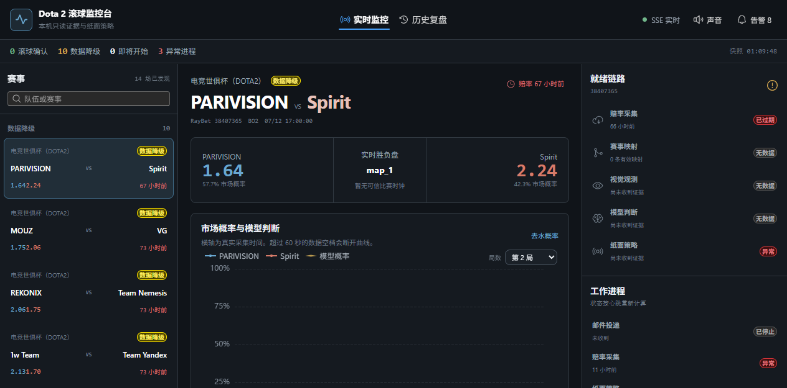

# Dogfood Report: Dota 2 滚球监控台

| Field | Value |
|-------|-------|
| **Date** | 2026-07-15 |
| **App URL** | http://127.0.0.1:8000/monitor |
| **Session** | dota2-monitor |
| **Scope** | 实时监控、历史复盘、数据状态、响应式布局与浏览器控制台 |

## Summary

| Severity | Count |
|----------|-------|
| Critical | 0 |
| High | 1 |
| Medium | 0 |
| Low | 0 |
| **Total** | **1** |

## Issues

### ISSUE-001: Fluent Tooltip 门户遮挡整个监控台

| Field | Value |
|-------|-------|
| **Severity** | high |
| **Category** | visual / functional |
| **URL** | http://127.0.0.1:8000/monitor |
| **Repro Video** | N/A |

**Description**

页面数据和无障碍树均已加载，但 Tooltip 门户继承根主题类后生成多个全屏不透明背景，导致监控台完全不可见。已通过关闭门户样式复制并移除门户 Tooltip 修复。

**Repro Steps**

1. 打开监控台，首屏仅显示深色背景。
   

2. 修复后刷新，三栏监控台正常显示。
   
