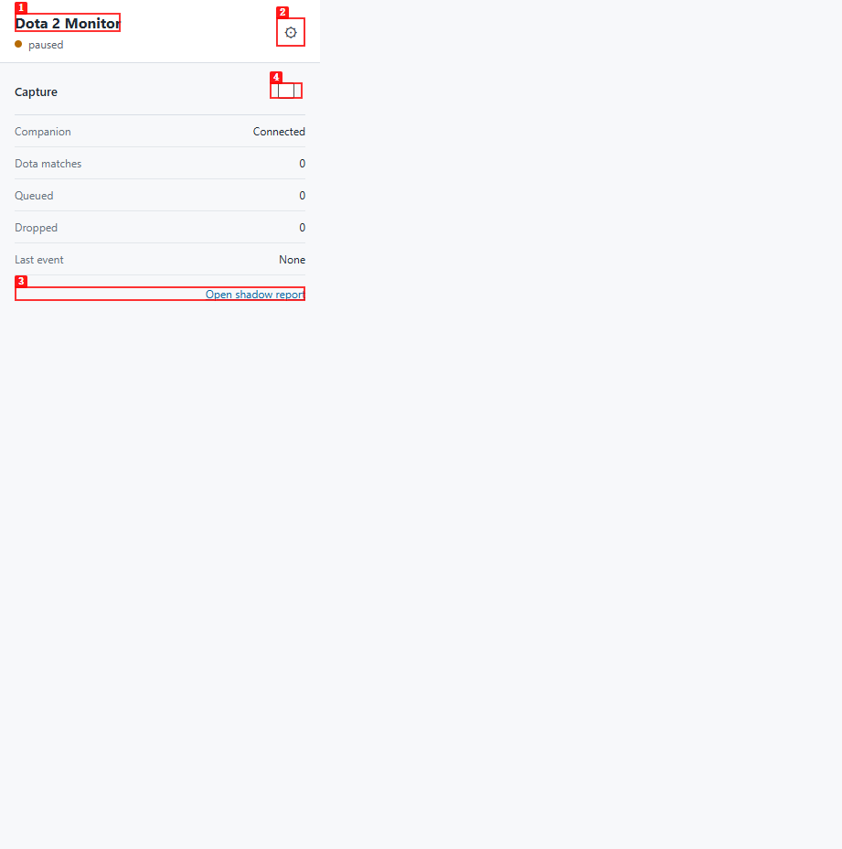
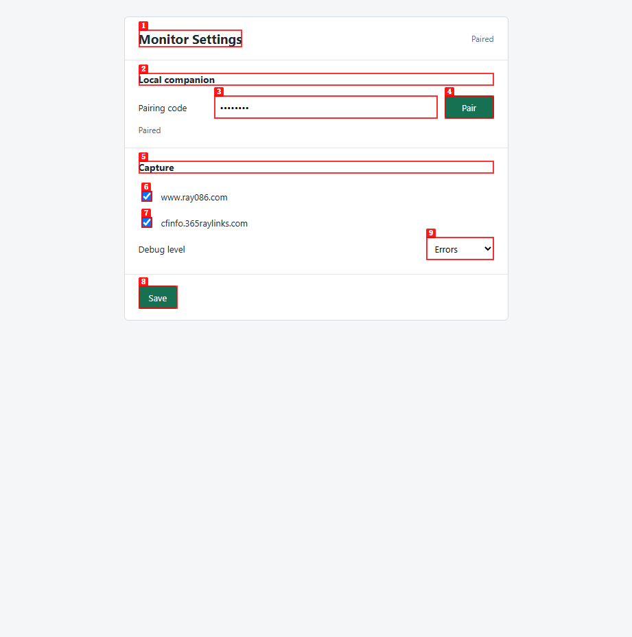
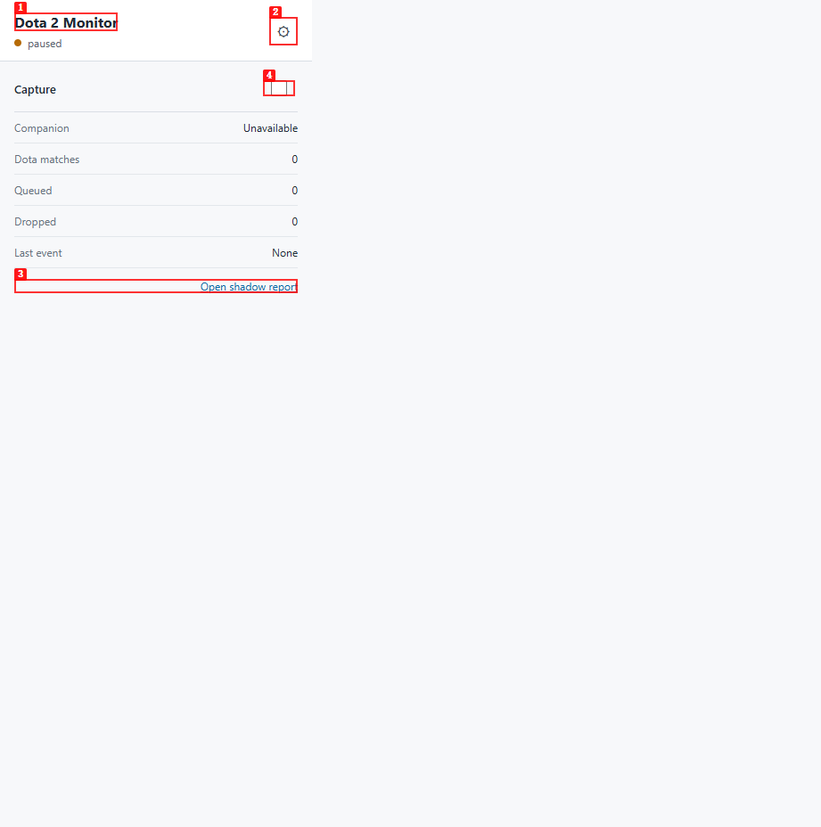
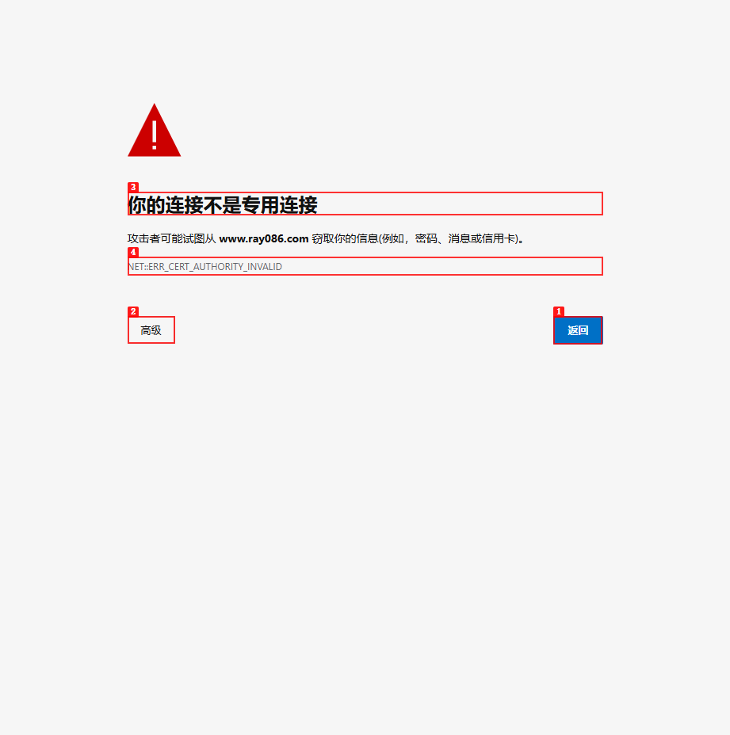
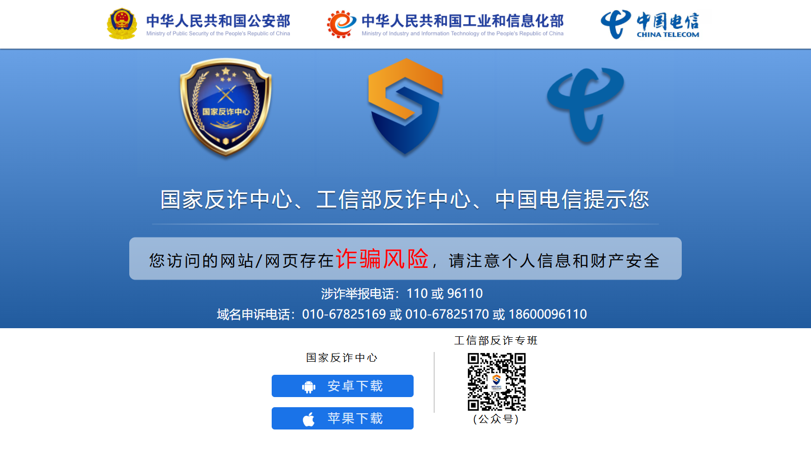
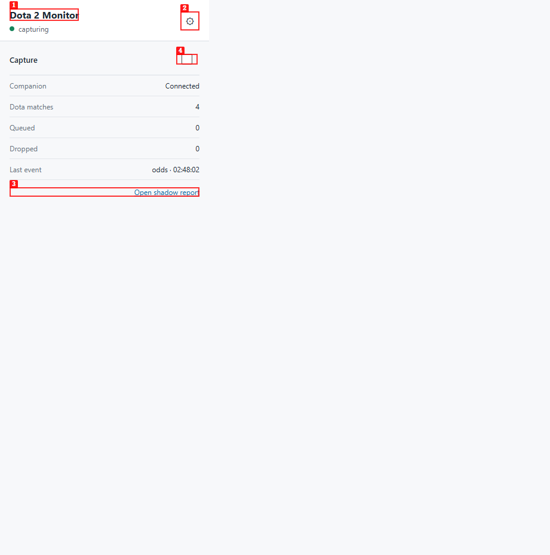

# Dogfood Report: RayBet Dota Extension Chain

| Field | Value |
|-------|-------|
| **Date** | 2026-07-14 |
| **App URL** | https://www.ray086.com/ |
| **Session** | raybet-task12-live |
| **Scope** | Read-only Dota 2 page and unpacked extension-to-local-companion event chain. Bet slip and order flows are excluded. |

## Summary

| Severity | Count |
|----------|-------|
| Critical | 0 |
| High | 1 |
| Medium | 0 |
| Low | 2 |
| **Total** | **3** |

## Validation Evidence

- The direct read-only RayBet API returned four real Dota 2 fixtures for 2026-07-14; no match was live during this session.
- Because the configured frontend was replaced by an anti-fraud page and its CSP blocked API fetches, the QA harness passed the real API objects through the extension's existing main-hook envelope. No odds, team, or match values were fabricated.
- Four `match_list` events were accepted as `game_id=151 / audit_only`; one odds event was `processed` into one browser transport and 14 exact response outcomes.
- Ten database invariant groups all had zero violations: Dota contract, URL redaction, transport lineage, transport state, response lineage, event cardinality, payload integrity, payload key allowlist, response key allowlist, and immutable triggers.
- Replaying the exact odds envelope with a new nonce returned `duplicate`; browser event, transport, outcome, decision, order, attempt, and notification counts were unchanged.
- Shadow safety remained intact: `shadow_orders=0`, `shadow_map_attempts=0`, and `notification_outbox=0`.
- The repaired popup reports `Connected` before a first event and immediately reports `paused` after Capture is disabled.
  

Authentication headers, cookies, pairing codes, raw response bodies, and account data were never written to this report.

## Issues

### ISSUE-001: Paired companion is shown as unavailable before the first event

| Field | Value |
|-------|-------|
| **Severity** | low |
| **Category** | ux |
| **URL** | chrome-extension://lifchhcfojpeahcbogfkpcfnkbmljgfe/src/popup.html |
| **Repro Video** | N/A; static status mismatch documented with two screenshots |

**Description**

The local companion was healthy and the settings page confirmed a successful pairing, but the popup reported `Unavailable`. The popup should report the authenticated companion as connected even when no browser event has been delivered yet.

**Resolution**

Fixed. Edge omitted the extension Origin on the signed GET status probe, so status now uses a signed POST while the backend keeps GET compatibility. A successful probe now updates the popup's derived companion state.

**Repro Steps**

1. Pair the extension while capture remains paused and confirm that settings shows `Paired`.
   

2. Open the popup in the same extension session.

3. **Observe:** `Companion` shows `Unavailable`, while the extension remains paired.
   

---

### ISSUE-002: Configured RayBet frontend host is blocked on the local network

| Field | Value |
|-------|-------|
| **Severity** | high |
| **Category** | functional |
| **URL** | https://www.ray086.com/ |
| **Repro Video** | N/A; environment-dependent static failure documented with screenshots |

**Description**

On this machine and network, the only frontend origin allowed by the extension does not serve the RayBet application. Edge first reports `NET::ERR_CERT_AUTHORITY_INVALID`; after explicitly continuing, the origin serves a Chinese anti-fraud warning page and makes no `/v2` requests. The direct read-only RayBet API remains available, so the failure is isolated to the configured frontend path. This blocks normal live-page capture on the current environment.

**Repro Steps**

1. Navigate to `https://www.ray086.com/` and observe the certificate interstitial.
   

2. Continue through the browser interstitial without clicking any page content.

3. **Observe:** the origin displays an anti-fraud warning instead of the RayBet application.
   

---

### ISSUE-003: Capture status label stays stale after toggling capture

| Field | Value |
|-------|-------|
| **Severity** | low |
| **Category** | ux |
| **URL** | chrome-extension://lifchhcfojpeahcbogfkpcfnkbmljgfe/src/popup.html |
| **Repro Video** | N/A; static post-toggle mismatch documented with a screenshot |

**Description**

Turning Capture off updates the switch and the service-worker state immediately, but the popup banner continues to display `capturing` until the popup is reloaded. The same stale-label behavior occurs in the opposite direction when capture is enabled. The banner should re-render from the returned state after a toggle.

**Resolution**

Fixed. The toggle handler now retrieves and renders the complete status after the service worker persists the new pause state.

**Repro Steps**

1. Open the popup while it shows `capturing`.

2. Turn the Capture switch off and wait one second.

3. **Observe:** the switch is off and the service-worker reports `paused=true`, but the banner still displays `capturing`.
   

---
